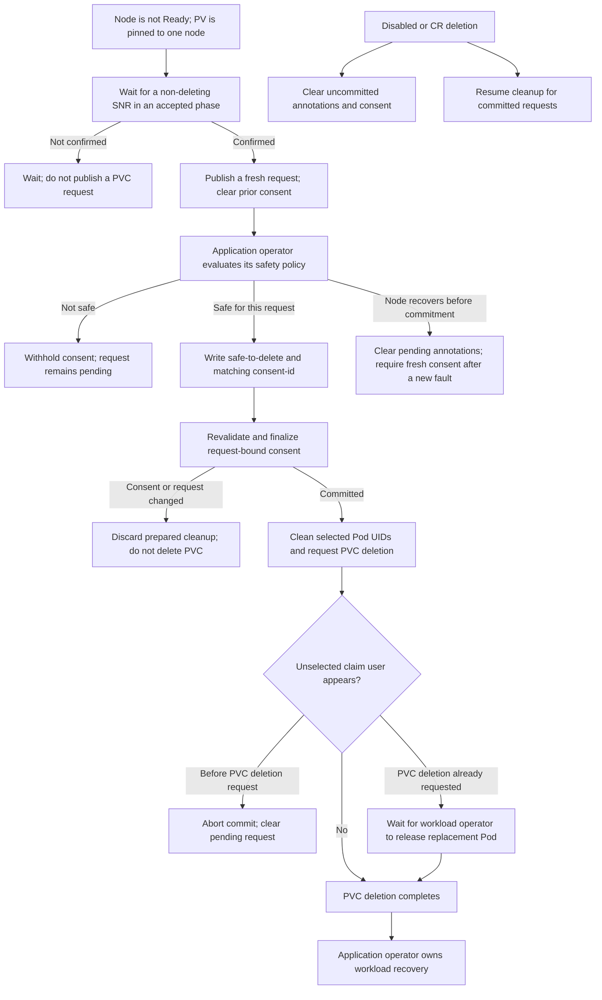

# PodRemediator architecture

This document describes the workload-independent contract of PodRemediator. It
does not describe a particular application's recovery policy or promise that an
application will recover after a PVC is removed.

For installation and operation, see the [operator guide](podremediator_guide.md).
Application-specific behavior is described in the [Galera integration](podremediator_galera.md)
and [RabbitMQ integration](podremediator_rabbitmq.md) documents. Test layers and
their responsibilities are described in the [testing guide](podremediator_testing.md).

## Purpose and boundary

A local persistent volume can remain bound to a node that is unhealthy or being
remediated. A workload may then be unable to start elsewhere. PodRemediator
coordinates deletion of a PVC only after it has current fencing evidence from
Self Node Remediation (SNR) and explicit consent from the operator that owns the
workload.

PodRemediator is not the authority on application data safety. It does not
decide whether a database has quorum, whether messages are replicated, or whether
an application can bootstrap. It does not repair or guarantee recovery of the
application. Those decisions belong to the workload's application operator.

A `PodRemediator` custom resource is namespaced. Each instance scans and cleans
PVCs only in its own namespace; create one instance in each workload namespace
that needs this behavior. Node and SNR observations are cluster-scoped inputs.

## Participants

- **Node Health Check (NHC)** detects a node failure and starts remediation
  according to its configuration.
- **Self Node Remediation (SNR)** performs its configured node remediation and
  reports progress through a `SelfNodeRemediation` resource. PodRemediator uses
  SNR status as the fencing barrier; it does not independently verify whether a
  machine was powered off, rebooted, or isolated.
- **PodRemediator** identifies supported local PVCs associated with an unhealthy
  node, publishes a fault-scoped request, validates consent, and carries out the
  committed Pod/PVC cleanup.
- **The application operator** evaluates workload-specific safety and is the
  only participant that grants or withholds consent.
- **Kubernetes** enforces PVC protection while a Pod still uses a claim. A
  replacement Pod can therefore keep a PVC deletion pending.

The generic contract applies equally to application operators in this repository
and in other repositories. Their safety policies and internal health signals
remain separate from the PodRemediator controller.

## Remediation flow

1. PodRemediator finds a PVC bound to a supported local PV pinned to a node that
   is not Ready. A NotReady node alone is not enough to start a request.
2. It waits for a non-deleting SNR resource for that node to report
   `Reboot-Completed` or `Fencing-Completed`. Until then, the PVC is not given a
   remediation request, so the application operator has no PVC signal to
   authorize. PodRemediator status reports PVCs waiting for fencing.
3. After fencing is confirmed, PodRemediator writes the request annotations and
   removes any consent from an earlier request. The request identifies the
   current PodRemediator, PVC, SNR, and node incarnation.
4. The application operator evaluates its own safety policy. To authorize this
   request, it sets `safe-to-delete=true` and copies the current `request-id` to
   `consent-id` in the same optimistic-locking PVC update.
5. PodRemediator revalidates the current request and the PVC's local-PV
   provenance before crossing its deletion commit boundary. If consent is
   withdrawn or the PVC/request changes before that boundary, the prepared
   deletion is discarded and cleanup does not proceed.
6. After the consent commit, PodRemediator cleans up the selected Pod UIDs and
   requests PVC deletion. Subsequent consent withdrawal, node recovery,
   disablement, SNR removal, or PodRemediator deletion does not revoke that
   consent. If a new, unselected claim user appears before the PVC deletion
   request, PodRemediator aborts the cleanup and clears the pending request. If
   the PVC deletion request has already been accepted, Kubernetes cannot undo
   it; the controller retains its finalizer while the workload operator releases
   any replacement Pod that is holding the claim.

`Reboot-Completed` and `Fencing-Completed` are SNR lifecycle phases, not claims
that the local volume has moved or that the application is healthy. In the SNR
lifecycle, `Reboot-Completed` can precede workload cleanup and
`Fencing-Completed` follows it. PodRemediator accepts either phase as its
configured safety barrier. If the node returns Ready before commitment, pending
handshake annotations are cleared so a later independent failure requires fresh
consent. A missing Node object is not treated as recovery: PodRemediator keeps
the handshake and proceeds only if it can still establish current SNR evidence
and prove that the PV is pinned to the affected node.

This separation explains why PodRemediator waits even if a reboot is expected to
restore a node. The controller requires SNR's explicit phase instead of
inferring fencing from elapsed time or Node readiness. And even after that
barrier, the PV may remain bound and pinned to the original node; application
recovery is a separate responsibility.

## Consent contract

The annotation names are defined in
[`apis/remediation/v1beta1/annotations.go`](../apis/remediation/v1beta1/annotations.go).
The values have distinct purposes:

- `remediation.openstack.org/pvc-stuck-on-node` is set by PodRemediator to the
  node name. It signals that the application operator should evaluate the PVC;
  it is not consent by itself.
- `remediation.openstack.org/request-id` is an opaque, non-empty identifier for
  this PodRemediator/PVC/SNR request. It allows the application operator to
  distinguish a current request from a stale one. It is not a safety signal and
  must not be interpreted as proof that deletion is safe.
- `remediation.openstack.org/remediator-uid` identifies the PodRemediator CR
  that owns the pending request. `remediation.openstack.org/fencing-node-uid`
  identifies the node incarnation associated with the fencing evidence.
- `remediation.openstack.org/safe-to-delete=true` is the application's
  authorization. `remediation.openstack.org/consent-id` must contain the exact
  current `request-id` evaluated by that application operator.

PodRemediator accepts consent only when the request ID is present,
`safe-to-delete` is exactly `true`, and `consent-id` equals that request ID.
Writing the two consent annotations together with optimistic concurrency avoids
accidentally acknowledging a different request during a race. An application
operator should ignore an empty or changed request ID, run its safety policy,
and write both consent fields atomically. Merely setting `safe-to-delete` is not
sufficient.

These annotations are a coordination protocol, not authentication. The IDs
prevent stale consent from being reused; they do not prove which principal wrote
the consent. Kubernetes authorization must restrict PVC annotation updates to
trusted workload operators and protect PodRemediator's controller-owned commit
records from untrusted writers. PodRemediator validates request freshness and
resource provenance, but cannot authenticate the writer of a PVC annotation.

Consent can be revoked before the commit boundary. The prepared state is then
removed and the PVC is not deleted. After that boundary, changing annotations
does not revoke the recorded consent, although a newly observed, unselected
claim user can still abort cleanup before the PVC deletion request. Once that
request is accepted, deletion cannot be undone; Kubernetes PVC protection may
keep it pending until a replacement Pod is released. This distinction separates
revocation of a pending decision from safe handling of workload changes during
cleanup.

## Disablement and deletion

Setting `spec.disabled: true` prevents new requests. PodRemediator still
reconciles for two bounded purposes: it clears uncommitted handshake and consent
annotations in its namespace, and it resumes cleanup that already crossed the
consent commit boundary. The first behavior cancels pending authorization; the
second preserves the recorded consent while still applying the claim-user checks
described above. Cleanup errors are retried.

Deleting the `PodRemediator` resource also clears uncommitted handshake state.
Its finalizer remains until annotation cleanup succeeds and already-committed
cleanup either completes or is safely aborted before the PVC deletion request.
Thus deleting or disabling the resource cannot silently abandon an operation
that Kubernetes has already accepted.

If NHC or SNR is unavailable, PodRemediator reports `Ready=False` and does not
start a new handshake. A missing or unrecognized SNR phase similarly prevents a
request from being authorized. An existing PVC annotation is not a substitute
for current fencing evidence.

## Local PV eligibility

PodRemediator considers Kubernetes `Local`, CSI, and `HostPath` PVs only when the
PV's required node affinity proves that it is pinned exclusively to one node.
Every node-selector alternative must select the same node through a supported
topology key, using `In` with one non-empty value. Ambiguous alternatives,
unsupported affinity requirements, conflicting node values, or missing node
affinity fail closed and are skipped.

The currently recognized keys are `kubernetes.io/hostname`,
`topology.topolvm.io/node`, and `topology.lvms.io/node`. The source of truth is
`localPVNodeTopologyKeys` in
[`internal/controller/remediation/podremediator_controller.go`](../internal/controller/remediation/podremediator_controller.go);
support for another CSI driver requires an explicit code change and tests.

Zone-affinity or network-attached volumes, such as Cinder volumes selected by
availability zone, are excluded because their topology does not prove that a
claim is pinned to the failed node. Deleting those PVCs is not the generic
mechanism for recovering them. CSI alone does not make a PV local: its affinity
must still identify one node unambiguously.

## Current limitations

- PodRemediator authorizes cleanup, not application recovery. A workload may
  remain unavailable after its PVC is removed; application-specific rejoin,
  bootstrap, and data-recovery procedures are outside this controller's scope.
- A replacement Pod that uses a terminating PVC can keep PVC protection in
  place. PodRemediator does not delete that replacement Pod or change workload
  replica counts. It reports the blocked cleanup and retains its finalizer until
  the workload operator safely releases the claim.
- Supported local PV affinity keys are explicit. A local CSI driver with an
  unrecognized topology key is skipped until support is added.
- PodRemediator status does not expose a structured per-PVC remediation list,
  and the controller does not emit Kubernetes Events for each handshake step.
  Operators can inspect the PVC annotations, application-operator status, and
  controller logs.
