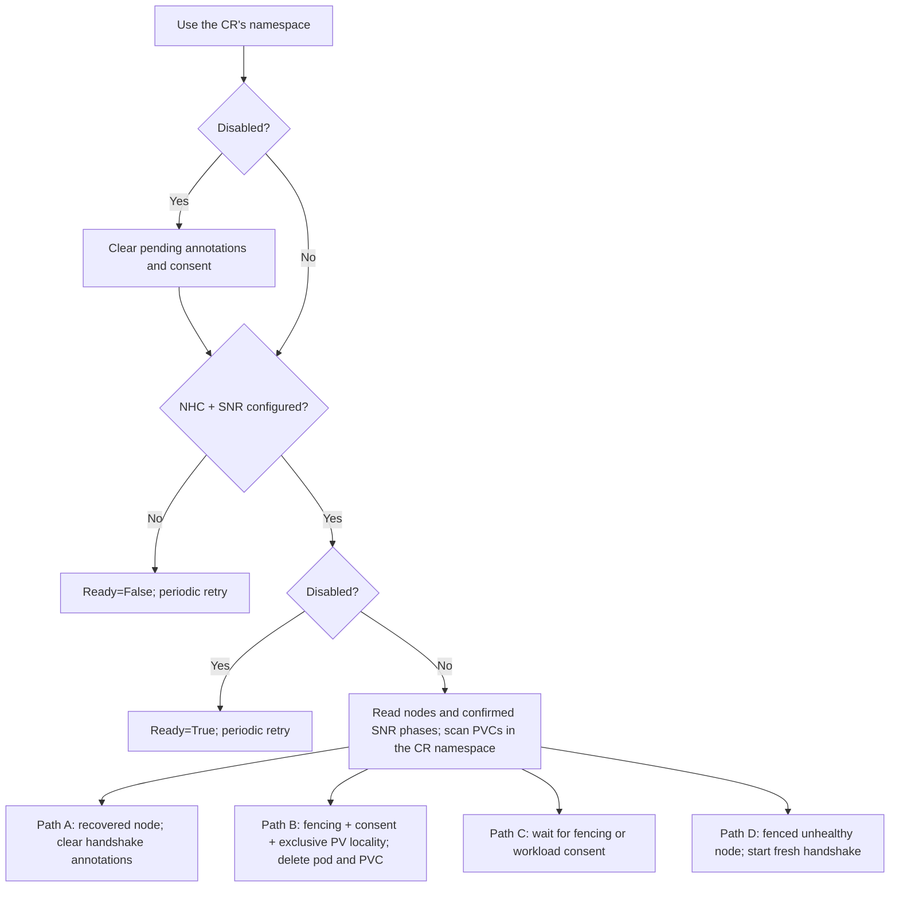

# PodRemediator – Architecture Reference

Developer-facing reference covering controller internals, reconcile flow, local PV
detection, known limitations, design risks, and roadmap.

For operator/user documentation see [podremediator_guide.md](podremediator_guide.md).

**Contents**

| Section | Description |
|---------|-------------|
| 1 | Design context — agreed principles, BGP reference pattern, Galera contract |
| 2 | API and Custom Resource — types, spec, status, annotations |
| 3 | Controller internals — reconcile flow, Paths A/B/C/D, local PV detection, watches, RBAC |
| 4 | Implementation history — fixed bugs F1-F11 |
| 5 | Known limitations — open gaps |
| 6 | Design risks — accepted Phase 1 trade-offs |
| 7 | Roadmap — features needed before production |
| 8 | Test coverage gaps |

---

## 1. Design Context

### 1.1 Problem

Stateful workloads that use **local persistent storage** (e.g. Galera, RabbitMQ) face a
recurring issue during node failures: the pod may be rescheduled but the PVC remains
bound to the dead node. Local storage cannot be reattached elsewhere; recovery requires
manual PVC deletion until a dedicated mechanism exists.

### 1.2 Agreed Principles

1. **Operator-driven authorization** — only the application operator (Galera, RabbitMQ)
   should decide when PVC deletion is safe. It has the context (quorum, replication,
   corruption) to avoid data loss.
2. **Externalized action** — deletion is performed by a separate generic controller;
   application operators stay focused.
3. **Signal-based integration** — the app operator signals readiness via
   `remediation.openstack.org/safe-to-delete=true` on the PVC.
4. **Alignment with NHC/SNR** — the controller waits for NHC to create a
   `SelfNodeRemediation` CR with confirmed fencing before starting any handshake.

### 1.3 BGP Controller — Reference Pattern

PodRemediator follows the same structural pattern as the BGP controller in infra-operator:

- **CR** (PodRemediator): activates the controller and provides configuration.
- **For(CR)**: CR events trigger reconcile.
- **Watches** on Nodes and PVCs: map functions return reconcile requests for matching CRs.
- **Predicates** filter to relevant events only.
- **Reconcile**: lists Nodes, PVCs, PVs; drives the annotation handshake; patches status.

### 1.4 Galera Operator Integration

Galera requires special coordination. Agreed separation of concerns:

- **PodRemediator** surfaces platform facts (node unreachable, PVC stuck).
- **Galera/MariaDB operator** decides safe recovery: quorum check, seqno ordering,
  whether to bootstrap or reform. It sets `safe-to-delete=true` only when safe.
- **PVC deletion is a separate policy layer** — decoupled from Galera bootstrap logic.

The mariadb-operator `podremediator` branch implements `CheckForStuckPVCRequiringRemediation`
with the following safety layers (all active):

1. **k8s quorum gate** — `AvailableReplicas >= floor(Replicas/2)+1` before any consent.
2. **wsrep gate** — live `wsrep_cluster_size` queried via pod exec; fail-closed if
   exec or the query fails, so no consent is granted without a successful check.
3. **Seqno-aware ordering** — the pod with the highest seqno (most up-to-date data) receives
   consent last; among the rest, lowest-ordinal first. One PVC per reconcile.
4. **Status observability** — `Galera.status.pvcRemediation` reflects in-flight handshake
   state (stuckNode, consentGranted) on every reconcile; nil when cluster is healthy.
5. **Auto-detection** — uses the REST mapper to check if the PodRemediator CRD is installed.
   If PodRemediator is not present the function is a silent no-op; no config needed.

---

## 2. API and Custom Resource

**API group**: `remediation.openstack.org/v1beta1`
**Kind**: `PodRemediator` (Namespaced)

**Source files**:
- `apis/remediation/v1beta1/podremediator_types.go`
- `apis/remediation/v1beta1/annotations.go`
- `config/crd/bases/remediation.openstack.org_podremediators.yaml` (`make manifests`)

### 2.1 Spec

| Field | Type | Default | Description |
|-------|------|---------|-------------|
| `disabled` | `bool` | `false` | Stop new handshakes and clear pending consent; committed cleanup continues. |
| `consentPollInterval` | `*metav1.Duration` | `"2m"` | Fallback requeue interval while waiting for fencing or consent. Overrides `PODREMEDIATOR_CONSENT_POLL_INTERVAL`. |
| `periodicPollInterval` | `*metav1.Duration` | `"5m"` | Safety-net requeue for idle states (catches restart-recovery case). Overrides `PODREMEDIATOR_PERIODIC_POLL_INTERVAL`. |

### 2.2 Status Conditions

| Condition | Meaning |
|-----------|---------|
| `Ready=False` / `NHC/SNRNotFound` | NHC or SNR CRs not installed |
| `Ready=False` / `Error` | Scan error; will retry |
| `Ready=True` | Monitoring or active remediation |
| `InputReady=False` | NHC/SNR dependency not satisfied |

### 2.3 PVC Annotations (shared contract)

Defined in `apis/remediation/v1beta1/annotations.go`. Application operators must
use these exact strings (import the package or copy with a cross-reference comment).

| Annotation | Set by | Value | Meaning |
|-----------|--------|-------|---------|
| `remediation.openstack.org/pvc-stuck-on-node` | PodRemediator | node name | Starts the consent handshake |
| `remediation.openstack.org/request-id` | PodRemediator | CR/PVC/SNR identity | Identifies the fault-scoped request |
| `remediation.openstack.org/remediator-uid` | PodRemediator | PodRemediator UID | Binds the handshake to its owning CR |
| `remediation.openstack.org/fencing-node-uid` | PodRemediator | Node UID | Binds the handshake to the node incarnation |
| `remediation.openstack.org/safe-to-delete` | Application operator | `"true"` | Grants deletion consent |
| `remediation.openstack.org/consent-id` | Application operator | Exact `request-id` | Binds consent to the current request |

The application operator must patch `safe-to-delete` and `consent-id` together using
the current `request-id`. All handshake annotations are removed on node recovery
(Path A) or CR deletion (`reconcileDelete`).

---

## 3. Controller Internals

**Location**: `internal/controller/remediation/podremediator_controller.go`

### 3.1 Reconcile Entry

1. Fetch the `PodRemediator` instance; return if not found.
2. Initialise status conditions; defer: restore timestamps, mirror Ready, patch status.
3. Add finalizer on first creation; requeue.
4. If `DeletionTimestamp` is set → `reconcileDelete`.
5. Otherwise → `reconcileNormal`.

### 3.2 reconcileDelete

Strips all handshake annotations from PVCs in the PodRemediator's namespace. The
finalizer is **not** removed if either a PVC **list** or a **patch** call fails
(`cleanupFailed=true` on either error type) — the reconcile requeues and retries.
This atomicity guarantee prevents stale consent from being honoured if the CR is
re-created during an active fault.

### 3.3 reconcileNormal — Paths A/B/C/D



Each PodRemediator watches local PVCs only in its own namespace. Create one
PodRemediator per workload namespace; the controller never lists or cleans PVCs
from another namespace.

Disabled mode cancels all pending handshakes in the CR namespace, even when
NHC/SNR dependencies are unavailable. Cleanup failures return an error and retry.
Re-enabling starts a fresh handshake and requires new workload consent.

The controller lists Nodes and active `SelfNodeRemediation` objects. Only
`status.phase: Reboot-Completed` or `Fencing-Completed` confirms fencing. SNR sets
`Reboot-Completed` after its safe reboot deadline and before removing workloads;
`Fencing-Completed` follows that removal. A missing phase, unknown phase, deleting
SNR, or missing SNR never authorizes deletion. Merely observing an elapsed
`timeAssumedRebooted` is insufficient. See the
[SNR controller](https://github.com/medik8s/self-node-remediation/blob/main/internal/controller/selfnoderemediation_controller.go).

Every reconcile scans existing handshakes, including when all remaining Nodes are
healthy. A missing Node does not imply recovery.

- **Path A — node recovered:** when the annotated node exists and is healthy,
  remove the handshake annotations so the next fault requires fresh consent.
- **Path B — consent granted:** require confirmed fencing, `safe-to-delete=true`,
  and a bound local PV exclusively pinned to the annotated node. Record the
  selected Pod UIDs in a prepared controller-owned ConfigMap. A first PVC write
  installs a provisional marker and token. A second optimistic-lock PVC write
  finalizes the token while consent is still present; that write is the
  irrevocable consent boundary. The provisional marker cannot authorize cleanup.
  The ConfigMap is then promoted and the selected Pods and
  PVC are removed. A new claim user or a Pod on another node aborts deletion
  and clears the pending handshake before the PVC is deleted. If a replacement
  appears after the PVC deletion request, the commit and CR finalizer stay
  pending while PVC protection holds the claim. Once committed, cleanup resumes
  across SNR loss, node recovery, disablement, and CR deletion.
- **Path C — waiting:** retain the handshake while fencing or consent is missing.
  If an SNR expires or is removed while its node is still unhealthy, deletion
  pauses until fencing can be confirmed again. PVC annotation events trigger
  reconciliation, as do SNR phase changes.
- **Path D — new fault:** only annotate a local PVC after fencing is confirmed for
  its unhealthy node. Strip pre-existing consent in the same patch.

Annotation patches use optimistic concurrency so a concurrent consent change
cannot be silently overwritten. Scan or cleanup failures return an error;
otherwise PVCs waiting for fencing (including those not yet annotated) or consent
use `consentPollInterval`; idle scans use `periodicPollInterval`. Polling remains
a fallback if an SNR or PVC event is missed.

### 3.4 Poll Interval Resolution

```
effectiveInterval(spec.X, r.X, DefaultX):
  spec.X != nil  → use spec.X   (CR, per-instance, hot-reloadable)
  r.X > 0        → use r.X      (env var via main.go, operator-wide)
  otherwise      → use DefaultX (hardcoded: consent=2m, periodic=5m)
```

### 3.5 Local PV Detection

**`isLocalPV(pv)`** accepts local, CSI, and HostPath volumes only when their
required node affinity exclusively identifies one node. Every OR selector term
must pin the same node using a known topology key with `operator: In` and exactly
one non-empty value. `NotIn`, multiple values, conflicting keys, and unpinned or
other-node alternatives are rejected. Additional AND constraints may narrow the
selection but cannot broaden it.

**`getLocalPVNodeName(pv)`** applies those checks using these known keys:

| Key | Driver |
|-----|--------|
| `kubernetes.io/hostname` | hostPath, local, many CSI |
| `topology.topolvm.io/node` | TopoLVM / Red Hat LVMS |
| `topology.lvms.io/node` | LVMS variant |

Zone-affinity volumes (Cinder: `topology.cinder.csi.openstack.org/zone`) are excluded.

If exclusive node pinning cannot be established, `getLocalPVNodeName` returns `""`
and remediation is skipped. Add supported keys to `localPVNodeTopologyKeys` when
integrating another local CSI driver.

### 3.6 Watches

| Trigger | Map function | Predicate |
|---------|-------------|-----------|
| `PodRemediator` (For) | — | — |
| `Node` | `enqueuePodRemediatorsClusterWide` — lists all PodRemediator CRs cluster-wide | `nodeReadyChangedPredicate` — fires only when NodeReady status transitions (not kubelet heartbeats) |
| `PVC` | `enqueuePodRemediatorsForNamespace` — lists only CRs in the PVC's namespace | `Or(GenerationChangedPredicate{}, AnnotationChangedPredicate{})` |

| `SelfNodeRemediation` | `enqueuePodRemediatorsClusterWide` | Creation, deletion, phase, node-name annotation/label, or deletion timestamp changes |

The SNR watch uses a separate dynamic informer and does not block controller
startup waiting for its cache to sync. If the optional SNR CRD is absent, the
informer retries in the background and connects when the API becomes available.
Watch events only trigger a scan; annotation and deletion still require live
fencing evidence and application consent as described above.

**Namespace matching in `enqueuePodRemediatorsForNamespace`:** a CR matches only
when the PVC namespace equals the CR namespace. This is the same logic used in
`reconcileNormal` to determine which namespace to scan.

The namespace-scoped PVC handler prevents a cluster-wide reconcile storm: when
PodRemediator sets `pvc-stuck-on-node` on a PVC in namespace A, only CRs watching
namespace A are enqueued — not every PodRemediator in the cluster.

### 3.7 RBAC

Deletion commits use the operator's existing ConfigMap permissions; no additional
RBAC grant is needed. Users allowed to update PVC consent annotations must not
have write access to the `podremediator-deletion-*` ConfigMaps, which are trusted
controller state. ConfigMap write access can forge a deletion commit.

| API group | Resources | Verbs |
|-----------|-----------|-------|
| `remediation.openstack.org` | `podremediators`, `podremediators/status`, `podremediators/finalizers` | full |
| `core` | `nodes`, `pods`, `persistentvolumeclaims`, `persistentvolumes` | get, list, watch (+delete for pods and PVCs) |
| `remediation.medik8s.io` | `nodehealthchecks` | get, list, watch |
| `self-node-remediation.medik8s.io` | `selfnoderemediationtemplates`, `selfnoderemediations` | get, list, watch |

---

## 4. Implementation History — Fixed Issues

All bugs below are patched in the current controller:

| # | Issue | Fix |
|---|-------|-----|
| F1 | PVC stayed `Terminating`: pod never deleted → `pvc-protection` finalizer stuck | `deletePodsForPVC` force-deletes (gracePeriod=0) referencing pods before PVC delete |
| F2 | Resume path deleted annotated PVC even if node had since recovered | Path A now checks `rawUnhealthyNodes[nodeName]`; removes stale annotation if node healthy |
| F3 | PVC watch could enqueue unrelated cross-namespace CRs | PVC watch and reconciliation are namespace-scoped |
| F4 | `reconcileDelete` removed finalizer while leaving orphan annotations | Strips all handshake annotations before removing finalizer; returns error if patch fails |
| F5 | Node watch had no predicate; every kubelet heartbeat triggered full reconcile | `nodeReadyChangedPredicate` fires only on NodeReady status transitions |
| F6 | PVC list / PV fetch errors swallowed; controller still reported `Ready=True` | `hadError` flag causes requeue and `Ready=False` on any scan failure |
| F7 | `isLocalPV` accepted Cinder zone-affinity volumes (not node-local) | CSI/HostPath require a known node-pinning topology key |
| F8 | Controller annotated PVCs before NHC committed to remediate (SNR timing gap) | Path D gated on `snrGatedNodes` (node must have active `SelfNodeRemediation` CR) |
| F9 | Dead RBAC: `storageclasses` in markers but never accessed | Removed; follows least-privilege |
| F10 | Operator pod restart while node already NotReady missed pre-existing faults | All idle return paths use `RequeueAfter: periodicPollInterval` as safety net |
| F11 | Poll intervals were hardcoded constants; not tunable without a code change | `consentPollInterval` and `periodicPollInterval` configurable via CR spec and env vars |
| F12 | Annotation-patch failure not requeued (was §5.1) | `hadError=true` set before `continue` in Path D; reconcile requeues with `Ready=False` |
| F13 | `deletePodsForPVC` swallowed errors (was §5.2) | Returns `error`; caller sets `hadError=true` and skips PVC delete on pod deletion failure |

---

## 5. Known Limitations

### 5.1 No observability during active remediation (Low)

`Ready=True` covers both "monitoring" and "waiting for consent." The waiting count appears
in the message text but there is no machine-readable condition (`Remediating`) or status
fields (`status.remediatedPVCs`, `status.lastRemediation`) for alerting.

**Fix:** Add `Remediating` condition or structured status fields.

### 5.2 No Kubernetes Events emitted (Low)

PVC deletions and annotation changes are only visible in controller logs. No `kubectl
describe` will show PodRemediator involvement.

**Fix:** Emit `Warning` Events on the PVC and/or `PodRemediator` CR at each annotation
and deletion.

---

## 6. Design Risks — Accepted Phase 1 Trade-offs

### 6.1 SNR fencing compatibility

Annotation and deletion both require an active SNR in `Reboot-Completed` or
`Fencing-Completed`. Unknown status formats fail closed. Removing the SNR before
an in-flight handshake completes pauses deletion; existing annotations alone do
not prove fencing. Validate the installed SNR version and lifecycle in lab E2E
before rollout.

### 6.2 New local CSI drivers not in the topology key allowlist

`isLocalPV` uses an explicit allowlist of known node-pinning topology keys. A new local
CSI driver with a custom key will be silently excluded. Add missing keys to
`localPVNodeTopologyKeys`.

### 6.3 StatefulSet recovery not guaranteed

After PVC deletion, workload recovery may create a new PVC and Pod on a healthy
node. A live StatefulSet can recreate an ordinal while the old PVC is still
terminating. PodRemediator will not force-delete that replacement or scale the
StatefulSet: consent selected one PVC and its observed Pod UIDs, while scaling a
multi-replica StatefulSet to zero could stop healthy quorum members. The
controller reports `Ready=False` with reason `ReplacementPodBlocksPVCDeletion`,
retains its commit and finalizer, and retries until the workload operator safely
pauses recreation and releases the replacement Pod. Therefore automatic
convergence at the intended nonzero replica count is not guaranteed under this
consent contract.

Recovery can also fail if:
- **LVMS capacity exhausted** — new PVC stays Pending.
- **RabbitMQ `inconsistent_cluster`** — observed in lab; requires manual StatefulSet
  scale + PVC replacement. Document in runbook if encountered.
- **Galera bootstrap** — without the Galera operator driving bootstrap, the pod
  CrashLoopBackOfs. This is the Phase 1 Galera limitation.

### 6.4 Galera production readiness

The consent handshake, seqno-aware ordering, wsrep gate, and status observability are
all implemented on the mariadb-operator `podremediator` branch. The remaining gap before
production is:

- **Galera bootstrap after deletion** — after PodRemediator deletes the stuck PVC and the
  StatefulSet schedules a new pod, the joining member must successfully bootstrap via gcomm.
  The mariadb-operator already handles bootstrap sequencing; this item is about ensuring the
  logic is robust under the PVC-deletion-and-rejoin scenario in a real cluster E2E test.

---

## 7. Roadmap — Features Before Production

### For RabbitMQ

> **Status:** RabbitMQ consent and status integration for infra-operator's
> `rabbitmqs.rabbitmq.openstack.org` CR is pending in PR #684. Until that work lands,
> this CR does not grant `safe-to-delete` consent to PodRemediator. The separate
> upstream `rabbitmqclusters.rabbitmq.com` integration remains out of scope for Phase 1.

| Priority | Feature | Status |
|----------|---------|--------|
| P0 | SNR-gated annotation in PodRemediator (F8) | ✅ Done |
| P0 | Consent infrastructure in PodRemediator | ✅ Done — PodRemediator side only |
| **P0** | **rabbitmq-cluster-operator sets `safe-to-delete` after quorum checks** | Out of scope for Phase 1 — upstream `rabbitmqclusters.rabbitmq.com` is a follow-up |
| P0 | `rabbitmqs.rabbitmq.openstack.org` consent (infra-operator's own RabbitMQ CR) | Pending — dependent on PR #684 |
| P0 | `status.pvcRemediation` observability for RabbitMQ | Pending — dependent on PR #684 |
| P1 | RabbitMQ-level quorum check (`rabbitmqctl` or CR status) instead of `AvailableReplicas` only | Open |
| P1 | Fix F13 — `deletePodsForPVC` error handling | ✅ Done |
| P1 | Fix F12 — annotation-patch failure requeue | ✅ Done |
| P2 | Kubernetes Events on annotation/deletion | Open |
| P2 | `status.lastRemediation` / `status.remediatedPVCs` on PodRemediator | Open |
| P0 | SNR phase check before annotation and deletion | ✅ Done |

### For Galera (in addition to all RabbitMQ items)

| Priority | Feature | Status |
|----------|---------|--------|
| P0 | Consent infrastructure in PodRemediator | ✅ Done |
| P0 | Galera/MariaDB operator sets `safe-to-delete` after safety checks | ✅ Done (mariadb-operator `podremediator` branch) |
| P0 | Ordering: never annotate highest-seqno member's PVC first | ✅ Done (mariadb-operator `podremediator` branch) |
| P0 | Signal unreachable member on Galera CR `.status` | ✅ Done — `status.pvcRemediation` map (mariadb-operator `podremediator` branch) |
| P1 | wsrep-level consent check (not just `AvailableReplicas`) | ✅ Done — fail-closed via pod exec (mariadb-operator `podremediator` branch) |

---

## 7b. RabbitMQ consent implementation design

> **Status:** `rabbitmqs.rabbitmq.openstack.org` consent and status integration is
> pending in stacked PR #684, outside this foundation PR. The upstream
> `rabbitmqclusters.rabbitmq.com` (rabbitmq-cluster-operator) integration is out of scope for Phase 1.

The RabbitMQ operator is **in this repo** (`infra-operator`). No external operator needed.

Verified from a running OSP cluster (2026-08-07):
- CRD: `rabbitmqs.rabbitmq.openstack.org` — Kind `RabbitMq`, API group `rabbitmq.openstack.org/v1beta1`
- Instances: `rabbitmq` and `rabbitmq-cell1` in namespace `openstack`
- Storage class: `lvms-local-storage` → node-pinned PVCs → remediation IS needed
- Queue type: `Quorum` (Raft-based)

**PR #684 implementation scope:**
- `apis/rabbitmq/v1beta1/rabbitmq_types.go` — add `PVCRemediationStatus` + field to `RabbitMqStatus`
- `internal/controller/rabbitmq/rabbitmq_controller.go` — add `CheckForStuckPVCRequiringRemediation`, PVC watch, call in reconcile loop

### Annotation constants

Already defined in `apis/remediation/v1beta1/annotations.go` — import directly:
```go
import remediationv1 "github.com/openstack-k8s-operators/infra-operator/apis/remediation/v1beta1"
// remediationv1.PVCStuckOnNodeAnnotation
// remediationv1.SafeToDeleteAnnotation
```

### PVC → CR mapping (verified from cluster)

| Entity | Convention |
|--------|-----------|
| StatefulSet name | `<RabbitMq.Name>-server` (e.g. `rabbitmq-server`) |
| Pod names | `<RabbitMq.Name>-server-<ordinal>` |
| PVC names | `persistence-<RabbitMq.Name>-server-<ordinal>` |
| PVC label selector | `app.kubernetes.io/name=<RabbitMq.Name>` (single label, confirmed) |

List PVCs with `client.MatchingLabels{"app.kubernetes.io/name": instance.Name}`.

### Status type to add on RabbitMq

```go
// In apis/rabbitmq/v1beta1/rabbitmq_types.go, add before RabbitMqStatus:
type PVCRemediationStatus struct {
    StuckNode      string `json:"stuckNode"`
    ConsentGranted bool   `json:"consentGranted,omitempty"`
}

// Add field to RabbitMqStatus:
// PVCRemediation map[string]PVCRemediationStatus `json:"pvcRemediation,omitempty"`
```

Also update `zz_generated.deepcopy.go` (same pattern as `GaleraStatus`).

### CheckForStuckPVCRequiringRemediation logic

```
1. Auto-detect PodRemediator via REST mapper:
     r.RESTMapper().RESTMapping(schema.GroupKind{Group:"remediation.openstack.org", Kind:"PodRemediator"})
   Return nil silently on IsNoMatchError. Gate on r.config != nil (unit-test guard).

2. List PVCs with MatchingLabels{"app.kubernetes.io/name": instance.Name}.
   Build candidates (pvc-stuck-on-node set, safe-to-delete not yet set) and
   newRemediationStatus (all annotated PVCs) in one pass.
   Set instance.Status.PVCRemediation = newMap (nil when empty).

3. If no candidates: return nil.

4. Sort candidates: lowest ordinal first.
   No seqno ordering — RabbitMQ Raft handles state sync; all surviving nodes are
   equally authoritative from the leader's perspective.

5. Safety gate (k8s): use instance.Status.ReadyCount (already set from
   sts.Status.ReadyReplicas by the main reconcile loop — no extra STS fetch needed).
   Check ReadyCount >= floor(*instance.Spec.Replicas/2)+1.
   Defer consent if below quorum.

6. Optional gate (RabbitMQ-level, fail-open): exec into a ready pod:
     rabbitmqctl cluster_status --formatter=json
   JSON has "running_nodes": [...]; check len >= quorum.
   If exec fails or r.config == nil: log V(1), skip gate (fail-open).
   This gate mirrors the wsrep gate in the Galera implementation.

7. Patch first candidate: set safe-to-delete=true. Update status.ConsentGranted=true.
   One PVC per reconcile.
```

### PVC watch wiring

Add to `SetupWithManager` in `rabbitmq_controller.go`:
```go
Watches(
    &corev1.PersistentVolumeClaim{},
    handler.EnqueueRequestsFromMapFunc(r.FindRabbitmqForPVC),
    builder.WithPredicates(predicate.And(
        predicate.AnnotationChangedPredicate{},
        predicate.NewPredicateFuncs(IsRabbitmqPVC),
    )),
)
```

```go
// IsRabbitmqPVC screens on app.kubernetes.io/name label (any value = owned by some Rabbitmq CR)
func IsRabbitmqPVC(obj client.Object) bool {
    _, ok := obj.GetLabels()["app.kubernetes.io/name"]
    return ok && strings.HasPrefix(obj.GetName(), "persistence-")
}

// FindRabbitmqForPVC maps a PVC to its owning Rabbitmq CR.
// PVC label app.kubernetes.io/name equals the Rabbitmq CR name directly.
func (r *Reconciler) FindRabbitmqForPVC(ctx context.Context, pvc client.Object) []reconcile.Request {
    crName, ok := pvc.GetLabels()["app.kubernetes.io/name"]
    if !ok { return nil }
    return []reconcile.Request{{NamespacedName: types.NamespacedName{
        Name: crName, Namespace: pvc.GetNamespace(),
    }}}
}
```

### Key differences from Galera

| Aspect | Galera (mariadb-operator) | RabbitMQ (infra-operator) |
|--------|--------------------------|--------------------------|
| Repo | mariadb-operator | **infra-operator (same repo)** |
| CR type | `Galera` / `mariadb.openstack.org` | `RabbitMq` / `rabbitmq.openstack.org` |
| Quorum source | `sts.Status.AvailableReplicas` | **`instance.Status.ReadyCount`** (already on CR) |
| Cluster-level gate | `mysql SHOW STATUS LIKE 'wsrep_cluster_size'` | `rabbitmqctl cluster_status --formatter=json` |
| Ordering | Highest seqno last | Lowest ordinal first (no seqno) |
| STS name | `<name>-galera` | `<name>-server` |
| PVC prefix | `mysql-db-` | `persistence-` |
| PVC label | `service=<name>-galera` | `app.kubernetes.io/name=<name>` |
| Annotation import | string constants (duplicated) | **direct import** (`apis/remediation/v1beta1`) |

---

## 8. Test Coverage Gaps

Functional tests cover CR lifecycle only. These scenarios need coverage:

| Scenario | Path | Priority |
|----------|------|---------|
| Unhealthy node + local PVC → PVC annotated | Path D | High |
| App operator sets `safe-to-delete=true` → PVC deleted | Path B | High |
| Pod force-deleted before PVC (`pvc-protection` unblock) | Path B ordering | High |
| SNR CR absent → PVC not annotated | Path D gate (F8) | High |
| Node recovers → handshake annotations removed | Path A | High |
| Node recovers with `safe-to-delete` present → handshake cleared | Path A + consent cleanup | High |
| PodRemediator in ns A, PVC in ns B → rejected/ignored | Cross-namespace isolation | Medium |
| `disabled=true` with NHC/SNR → `Ready=True`, no annotation | Disabled mode | Medium |
| `isLocalPV` table: local, LVMS, TopoLVM, Cinder (excluded), HostPath, no-affinity | PV classification | High |
| `getLocalPVNodeName` table: `kubernetes.io/hostname`, topolvm, lvms, multi-term | Node extraction | High |
| Operator pod restart with pre-existing unhealthy node → annotated within 5 min | F10 periodic poll | Medium |
