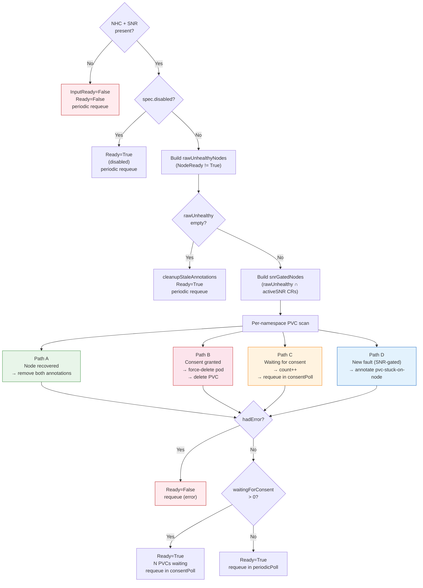

# PodRemediator – Architecture Reference

Developer-facing reference covering controller internals, reconcile flow, local PV
detection, known limitations, design risks, and roadmap.

For operator/user documentation see [podremediator_guide.md](podremediator_guide.md).

**Contents**

| Section | Description |
|---------|-------------|
| 1 | Design context — agreed principles, BGP reference pattern, Galera contract |
| 2 | API and Custom Resource — types, spec, status, annotations |
| 3 | Controller internals — reconcile flow, Paths A/B/C/D, local PV detection, watches, RBAC |
| 4 | Implementation history — fixed bugs F1-F11 |
| 5 | Known limitations — open gaps |
| 6 | Design risks — accepted Phase 1 trade-offs |
| 7 | Roadmap — features needed before production |
| 8 | Test coverage gaps |

---

## 1. Design Context

### 1.1 Problem

Stateful workloads that use **local persistent storage** (e.g. Galera, RabbitMQ) face a
recurring issue during node failures: the pod may be rescheduled but the PVC remains
bound to the dead node. Local storage cannot be reattached elsewhere; recovery requires
manual PVC deletion until a dedicated mechanism exists.

### 1.2 Agreed Principles

1. **Operator-driven authorization** — only the application operator (Galera, RabbitMQ)
   should decide when PVC deletion is safe. It has the context (quorum, replication,
   corruption) to avoid data loss.
2. **Externalized action** — deletion is performed by a separate generic controller;
   application operators stay focused.
3. **Signal-based integration** — the app operator signals readiness via
   `remediation.openstack.org/safe-to-delete=true` on the PVC.
4. **Alignment with NHC/SNR** — the controller waits for NHC to create a
   `SelfNodeRemediation` CR before starting any handshake.

### 1.3 BGP Controller — Reference Pattern

PodRemediator follows the same structural pattern as the BGP controller in infra-operator:

- **CR** (PodRemediator): activates the controller and provides configuration.
- **For(CR)**: CR events trigger reconcile.
- **Watches** on Nodes and PVCs: map functions return reconcile requests for matching CRs.
- **Predicates** filter to relevant events only.
- **Reconcile**: lists Nodes, PVCs, PVs; drives the annotation handshake; patches status.

### 1.4 Galera Operator Integration

Galera requires special coordination. Agreed separation of concerns:

- **PodRemediator** surfaces platform facts (node unreachable, PVC stuck).
- **Galera/MariaDB operator** decides safe recovery: quorum check, seqno ordering,
  whether to bootstrap or reform. It sets `safe-to-delete=true` only when safe.
- **PVC deletion is a separate policy layer** — decoupled from Galera bootstrap logic.

The mariadb-operator `podremediator` branch implements `CheckForStuckPVCRequiringRemediation`
with the following safety layers (all active):

1. **k8s quorum gate** — `AvailableReplicas >= floor(Replicas/2)+1` before any consent.
2. **wsrep gate** — live `wsrep_cluster_size` queried via pod exec; fail-open if exec fails.
3. **Seqno-aware ordering** — the pod with the highest seqno (most up-to-date data) receives
   consent last; among the rest, lowest-ordinal first. One PVC per reconcile.
4. **Status observability** — `Galera.status.pvcRemediation` reflects in-flight handshake
   state (stuckNode, consentGranted) on every reconcile; nil when cluster is healthy.
5. **Auto-detection** — uses the REST mapper to check if the PodRemediator CRD is installed.
   If PodRemediator is not present the function is a silent no-op; no config needed.

---

## 2. API and Custom Resource

**API group**: `remediation.openstack.org/v1beta1`  
**Kind**: `PodRemediator` (Namespaced)

**Source files**:
- `apis/remediation/v1beta1/podremediator_types.go`
- `apis/remediation/v1beta1/annotations.go`
- `config/crd/bases/remediation.openstack.org_podremediators.yaml` (`make manifests`)

### 2.1 Spec

| Field | Type | Default | Description |
|-------|------|---------|-------------|
| `namespaces` | `[]string` | (empty = CR namespace only) | Namespaces to watch for local PVCs. |
| `disabled` | `bool` | `false` | Skip annotation and deletion; monitoring only. |
| `consentPollInterval` | `*metav1.Duration` | `"2m"` | Requeue interval for Path C (waiting for consent). Overrides `PODREMEDIATOR_CONSENT_POLL_INTERVAL`. |
| `periodicPollInterval` | `*metav1.Duration` | `"5m"` | Safety-net requeue for idle states (catches restart-recovery case). Overrides `PODREMEDIATOR_PERIODIC_POLL_INTERVAL`. |

### 2.2 Status Conditions

| Condition | Meaning |
|-----------|---------|
| `Ready=False` / `NHC/SNRNotFound` | NHC or SNR CRs not installed |
| `Ready=False` / `Error` | Scan error; will retry |
| `Ready=True` | Monitoring or active remediation |
| `InputReady=False` | NHC/SNR dependency not satisfied |

### 2.3 PVC Annotations (shared contract)

Defined in `apis/remediation/v1beta1/annotations.go`. Application operators must
use these exact strings (import the package or copy with a cross-reference comment).

| Annotation | Set by | Value | Meaning |
|-----------|--------|-------|---------|
| `remediation.openstack.org/pvc-stuck-on-node` | PodRemediator | node name | Starts the consent handshake |
| `remediation.openstack.org/safe-to-delete` | Application operator | `"true"` | Grants deletion consent |

Both annotations are removed on node recovery (Path A) or CR deletion (`reconcileDelete`).

---

## 3. Controller Internals

**Location**: `internal/controller/remediation/podremediator_controller.go`

### 3.1 Reconcile Entry

1. Fetch the `PodRemediator` instance; return if not found.
2. Initialise status conditions; defer: restore timestamps, mirror Ready, patch status.
3. Add finalizer on first creation; requeue.
4. If `DeletionTimestamp` is set → `reconcileDelete`.
5. Otherwise → `reconcileNormal`.

### 3.2 reconcileDelete

Strips **both** `pvc-stuck-on-node` and `safe-to-delete` from all PVCs in all watched
namespaces. The finalizer is **not** removed if either a PVC **list** or a **patch** call
fails (`cleanupFailed=true` on either error type) — the reconcile requeues and retries.
This atomicity guarantee prevents stale consent from being honoured if the CR is
re-created during an active fault.

### 3.3 reconcileNormal — Paths A/B/C/D



**Step 1 — NHC/SNR check**  
Dynamic client lists `nodehealthchecks` and `selfnoderemediationtemplates`. Missing or
empty → `InputReady=False`, `Ready=False`; periodic requeue.

**Step 2 — Disabled check**  
`spec.disabled=true` → `Ready=True`; periodic requeue.

**Step 3 — Build rawUnhealthyNodes**  
List all Nodes. A node is unhealthy when NodeReady condition status is not `True`
(covers `False` and `Unknown`). A node with **no NodeReady condition at all** (e.g. just
joined the cluster) is treated as **healthy** (returns `false`). This set is used for
Paths A/B/C (in-flight management — not disrupted by SNR CR expiry after fencing).

**Step 4 — All nodes healthy**  
`rawUnhealthyNodes` empty → `cleanupStaleAnnotations` (removes both annotations from any
PVC that still carries them), `Ready=True`; periodic requeue.

**Step 5 — Build snrGatedNodes**  
`getNodesWithActiveSNR`: list `selfnoderemediations`, extract node name from annotation
`remediation.medik8s.io/node-name` (label fallback; logs and skips if neither present).
If the list call itself **fails** (API error), returns a wrapped error causing an
immediate error-requeue with no status update. Intersection of result with
`rawUnhealthyNodes` = `snrGatedNodes`. Nodes without SNR are logged and excluded from
Path D only. When `snrGatedNodes` is empty (all unhealthy nodes are pre-NHC or
post-fencing), **no early exit** — the PVC loop still runs so Paths A/B/C can complete
in-flight handshakes.

**Step 6 — Per-namespace PVC scan**

- **Path A — node recovered**: PVC has `pvc-stuck-on-node` but named node is no longer
  in `rawUnhealthyNodes`. Remove both annotations. App operator must re-consent next fault.

- **Path B — consent granted**: PVC has `pvc-stuck-on-node`, node still in
  `rawUnhealthyNodes`, `safe-to-delete=true`. Call `deletePodsForPVC`
  (force-delete, gracePeriod=0, **regardless of pod phase** — even `Terminating` or
  `Pending` pods referencing the PVC are force-deleted to release the
  `pvc-protection` finalizer) then delete PVC.

- **Path C — waiting**: PVC has `pvc-stuck-on-node`, node still unhealthy, no consent.
  Increment `waitingForConsent`; PVC watch (`AnnotationChangedPredicate`) triggers on
  app-operator response; periodic requeue provides liveness if event is missed.

- **Path D — new fault (SNR-gated)**: PVC unbound or no `pvc-stuck-on-node`, bound PV
  passes `isLocalPV`, PV node is in `snrGatedNodes`. Annotate PVC with `pvc-stuck-on-node`.

**Step 7 — Status**  
`hadError=true` → `Ready=False`, requeue (error). `waitingForConsent>0` → `Ready=True`
with count, requeue after `consentPoll`. Otherwise → `Ready=True`, requeue after `periodicPoll`.

### 3.4 Poll Interval Resolution

```
effectiveInterval(spec.X, r.X, DefaultX):
  spec.X != nil  → use spec.X   (CR, per-instance, hot-reloadable)
  r.X > 0        → use r.X      (env var via main.go, operator-wide)
  otherwise      → use DefaultX (hardcoded: consent=2m, periodic=5m)
```

### 3.5 Local PV Detection

**`isLocalPV(pv)`** returns `true` when `spec.nodeAffinity.Required` is set and:
- `spec.local` is non-nil (Kubernetes local volume), **or**
- `spec.csi` or `spec.hostPath` is set **and** `pvHasLocalTopologyKey(pv)` is true.

**`pvHasLocalTopologyKey(pv)`** checks required node affinity for a known key:

| Key | Driver |
|-----|--------|
| `kubernetes.io/hostname` | hostPath, local, many CSI |
| `topology.topolvm.io/node` | TopoLVM / Red Hat LVMS |
| `topology.lvms.io/node` | LVMS variant |

Zone-affinity volumes (Cinder: `topology.cinder.csi.openstack.org/zone`) are excluded.

**`getLocalPVNodeName(pv)`** scans the same keys and returns the first matching value.
Returns `""` and logs an `Info` message (not Error) if no key matches — PVC is silently
skipped. Add missing keys to `localPVNodeTopologyKeys` to support new local CSI drivers.

### 3.6 Watches

| Trigger | Map function | Predicate |
|---------|-------------|-----------|
| `PodRemediator` (For) | — | — |
| `Node` | `enqueuePodRemediatorsClusterWide` — lists all PodRemediator CRs cluster-wide | `nodeReadyChangedPredicate` — fires only when NodeReady status transitions (not kubelet heartbeats) |
| `PVC` | `enqueuePodRemediatorsForNamespace` — lists only CRs whose watched namespaces include the PVC's namespace | `Or(GenerationChangedPredicate{}, AnnotationChangedPredicate{})` |

**Namespace matching in `enqueuePodRemediatorsForNamespace`:** a CR matches if
`pvcNamespace ∈ spec.namespaces`, OR if `spec.namespaces` is empty and the CR's own
namespace equals `pvcNamespace`. This is the same logic used in `reconcileNormal` to
determine which namespaces to scan.

The namespace-scoped PVC handler prevents a cluster-wide reconcile storm: when
PodRemediator sets `pvc-stuck-on-node` on a PVC in namespace A, only CRs watching
namespace A are enqueued — not every PodRemediator in the cluster.

### 3.7 RBAC

| API group | Resources | Verbs |
|-----------|-----------|-------|
| `remediation.openstack.org` | `podremediators`, `podremediators/status`, `podremediators/finalizers` | full |
| `core` | `nodes`, `pods`, `persistentvolumeclaims`, `persistentvolumes` | get, list, watch (+delete for pods and PVCs) |
| `remediation.medik8s.io` | `nodehealthchecks` | get, list, watch |
| `self-node-remediation.medik8s.io` | `selfnoderemediationtemplates`, `selfnoderemediations` | get, list, watch |

---

## 4. Implementation History — Fixed Issues

All bugs below are patched in the current controller:

| # | Issue | Fix |
|---|-------|-----|
| F1 | PVC stayed `Terminating`: pod never deleted → `pvc-protection` finalizer stuck | `deletePodsForPVC` force-deletes (gracePeriod=0) referencing pods before PVC delete |
| F2 | Resume path deleted annotated PVC even if node had since recovered | Path A now checks `rawUnhealthyNodes[nodeName]`; removes stale annotation if node healthy |
| F3 | `pvcFN` only enqueued CRs in same namespace; cross-namespace CRs missed | PVC watch handler scoped by namespace; node handler cluster-wide |
| F4 | `reconcileDelete` removed finalizer while leaving orphan annotations | Strips both `pvc-stuck-on-node` and `safe-to-delete` before removing finalizer; returns error if patch fails |
| F5 | Node watch had no predicate; every kubelet heartbeat triggered full reconcile | `nodeReadyChangedPredicate` fires only on NodeReady status transitions |
| F6 | PVC list / PV fetch errors swallowed; controller still reported `Ready=True` | `hadError` flag causes requeue and `Ready=False` on any scan failure |
| F7 | `isLocalPV` accepted Cinder zone-affinity volumes (not node-local) | CSI/HostPath require a known node-pinning topology key |
| F8 | Controller annotated PVCs before NHC committed to remediate (SNR timing gap) | Path D gated on `snrGatedNodes` (node must have active `SelfNodeRemediation` CR) |
| F9 | Dead RBAC: `storageclasses` in markers but never accessed | Removed; follows least-privilege |
| F10 | Operator pod restart while node already NotReady missed pre-existing faults | All idle return paths use `RequeueAfter: periodicPollInterval` as safety net |
| F11 | Poll intervals were hardcoded constants; not tunable without a code change | `consentPollInterval` and `periodicPollInterval` configurable via CR spec and env vars |
| F12 | Annotation-patch failure not requeued (was §5.1) | `hadError=true` set before `continue` in Path D; reconcile requeues with `Ready=False` |
| F13 | `deletePodsForPVC` swallowed errors (was §5.2) | Returns `error`; caller sets `hadError=true` and skips PVC delete on pod deletion failure |

---

## 5. Known Limitations

### 5.1 No observability during active remediation (Low)

`Ready=True` covers both "monitoring" and "waiting for consent." The waiting count appears
in the message text but there is no machine-readable condition (`Remediating`) or status
fields (`status.remediatedPVCs`, `status.lastRemediation`) for alerting.

**Fix:** Add `Remediating` condition or structured status fields.

### 5.2 No Kubernetes Events emitted (Low)

PVC deletions and annotation changes are only visible in controller logs. No `kubectl
describe` will show PodRemediator involvement.

**Fix:** Emit `Warning` Events on the PVC and/or `PodRemediator` CR at each annotation
and deletion.

---

## 6. Design Risks — Accepted Phase 1 Trade-offs

### 6.1 SNR timing gap (residual after F8)

Path D annotates PVCs after NHC creates an SNR CR but before SNR confirms fencing is
complete. Annotation is benign; actual deletion (Path B) requires explicit app-operator
consent. An app operator that grants consent before fencing is confirmed could trigger
premature deletion — lower risk for local storage since the node is rebooted or isolated
shortly after SNR fires.

**Phase 2:** Inspect `SelfNodeRemediation.status.phase` to confirm fencing succeeded
before annotating PVCs.

### 6.2 New local CSI drivers not in the topology key allowlist

`isLocalPV` uses an explicit allowlist of known node-pinning topology keys. A new local
CSI driver with a custom key will be silently excluded. Add missing keys to
`localPVNodeTopologyKeys`.

### 6.3 StatefulSet recovery not guaranteed

After PVC deletion the StatefulSet creates a new PVC + pod on a healthy node. This fails if:
- **LVMS capacity exhausted** — new PVC stays Pending.
- **RabbitMQ `inconsistent_cluster`** — observed in lab; requires manual StatefulSet
  scale + PVC replacement. Document in runbook if encountered.
- **Galera bootstrap** — without the Galera operator driving bootstrap, the pod
  CrashLoopBackOfs. This is the Phase 1 Galera limitation.

### 6.4 Galera production readiness

The consent handshake, seqno-aware ordering, wsrep gate, and status observability are
all implemented on the mariadb-operator `podremediator` branch. The remaining gap before
production is:

- **Galera bootstrap after deletion** — after PodRemediator deletes the stuck PVC and the
  StatefulSet schedules a new pod, the joining member must successfully bootstrap via gcomm.
  The mariadb-operator already handles bootstrap sequencing; this item is about ensuring the
  logic is robust under the PVC-deletion-and-rejoin scenario in a real cluster E2E test.

---

## 7. Roadmap — Features Before Production

### For RabbitMQ

> **Important:** The consent handshake requires the **rabbitmq-cluster-operator** to
> implement the app-operator side — watch for `pvc-stuck-on-node` and set
> `safe-to-delete=true` after quorum safety checks. PodRemediator annotates PVCs
> correctly, but without consent from the RabbitMQ operator the PVC is **never deleted**.
> This is the primary blocking gap for RabbitMQ production use.

| Priority | Feature | Status |
|----------|---------|--------|
| P0 | SNR-gated annotation in PodRemediator (F8) | ✅ Done |
| P0 | Consent infrastructure in PodRemediator | ✅ Done — PodRemediator side only |
| **P0** | **rabbitmq-cluster-operator sets `safe-to-delete` after quorum checks** | Out of scope for Phase 1 — `rabbitmqs.rabbitmq.openstack.org` consent done; upstream `rabbitmqclusters.rabbitmq.com` is a follow-up |
| P0 | `rabbitmqs.rabbitmq.openstack.org` consent (infra-operator's own RabbitMQ CR) | ✅ Done |
| P0 | `status.pvcRemediation` observability on RabbitmqCluster CR | ✅ Done |
| P1 | RabbitMQ-level quorum check (`rabbitmqctl` or CR status) instead of `AvailableReplicas` only | Open |
| P1 | Fix F13 — `deletePodsForPVC` error handling | ✅ Done |
| P1 | Fix F12 — annotation-patch failure requeue | ✅ Done |
| P2 | Kubernetes Events on annotation/deletion | Open |
| P2 | `status.lastRemediation` / `status.remediatedPVCs` on PodRemediator | Open |
| P3 | SNR phase check (wait for fencing complete) | Open |

### For Galera (in addition to all RabbitMQ items)

| Priority | Feature | Status |
|----------|---------|--------|
| P0 | Consent infrastructure in PodRemediator | ✅ Done |
| P0 | Galera/MariaDB operator sets `safe-to-delete` after safety checks | ✅ Done (mariadb-operator `podremediator` branch) |
| P0 | Ordering: never annotate highest-seqno member's PVC first | ✅ Done (mariadb-operator `podremediator` branch) |
| P0 | Signal unreachable member on Galera CR `.status` | ✅ Done — `status.pvcRemediation` map (mariadb-operator `podremediator` branch) |
| P1 | wsrep-level consent check (not just `AvailableReplicas`) | ✅ Done — fail-open via pod exec (mariadb-operator `podremediator` branch) |

---

## 7b. RabbitMQ consent implementation design

> **Status: ✅ Implemented** — `rabbitmqs.rabbitmq.openstack.org` consent is done in this PR.
> The upstream `rabbitmqclusters.rabbitmq.com` (rabbitmq-cluster-operator) is out of scope for Phase 1.

The RabbitMQ operator is **in this repo** (`infra-operator`). No external operator needed.

Verified from a running OSP cluster (2026-08-07):
- CRD: `rabbitmqs.rabbitmq.openstack.org` — Kind `RabbitMq`, API group `rabbitmq.openstack.org/v1beta1`
- Instances: `rabbitmq` and `rabbitmq-cell1` in namespace `openstack`
- Storage class: `lvms-local-storage` → node-pinned PVCs → remediation IS needed
- Queue type: `Quorum` (Raft-based)

**Files to modify:**
- `apis/rabbitmq/v1beta1/rabbitmq_types.go` — add `PVCRemediationStatus` + field to `RabbitMqStatus`
- `internal/controller/rabbitmq/rabbitmq_controller.go` — add `CheckForStuckPVCRequiringRemediation`, PVC watch, call in reconcile loop

### Annotation constants

Already defined in `apis/remediation/v1beta1/annotations.go` — import directly:
```go
import remediationv1 "github.com/openstack-k8s-operators/infra-operator/apis/remediation/v1beta1"
// remediationv1.PVCStuckOnNodeAnnotation
// remediationv1.SafeToDeleteAnnotation
```

### PVC → CR mapping (verified from cluster)

| Entity | Convention |
|--------|-----------|
| StatefulSet name | `<RabbitMq.Name>-server` (e.g. `rabbitmq-server`) |
| Pod names | `<RabbitMq.Name>-server-<ordinal>` |
| PVC names | `persistence-<RabbitMq.Name>-server-<ordinal>` |
| PVC label selector | `app.kubernetes.io/name=<RabbitMq.Name>` (single label, confirmed) |

List PVCs with `client.MatchingLabels{"app.kubernetes.io/name": instance.Name}`.

### Status type to add on RabbitMq

```go
// In apis/rabbitmq/v1beta1/rabbitmq_types.go, add before RabbitMqStatus:
type PVCRemediationStatus struct {
    StuckNode      string `json:"stuckNode"`
    ConsentGranted bool   `json:"consentGranted,omitempty"`
}

// Add field to RabbitMqStatus:
// PVCRemediation map[string]PVCRemediationStatus `json:"pvcRemediation,omitempty"`
```

Also update `zz_generated.deepcopy.go` (same pattern as `GaleraStatus`).

### CheckForStuckPVCRequiringRemediation logic

```
1. Auto-detect PodRemediator via REST mapper:
     r.RESTMapper().RESTMapping(schema.GroupKind{Group:"remediation.openstack.org", Kind:"PodRemediator"})
   Return nil silently on IsNoMatchError. Gate on r.config != nil (unit-test guard).

2. List PVCs with MatchingLabels{"app.kubernetes.io/name": instance.Name}.
   Build candidates (pvc-stuck-on-node set, safe-to-delete not yet set) and
   newRemediationStatus (all annotated PVCs) in one pass.
   Set instance.Status.PVCRemediation = newMap (nil when empty).

3. If no candidates: return nil.

4. Sort candidates: lowest ordinal first.
   No seqno ordering — RabbitMQ Raft handles state sync; all surviving nodes are
   equally authoritative from the leader's perspective.

5. Safety gate (k8s): use instance.Status.ReadyCount (already set from
   sts.Status.ReadyReplicas by the main reconcile loop — no extra STS fetch needed).
   Check ReadyCount >= floor(*instance.Spec.Replicas/2)+1.
   Defer consent if below quorum.

6. Optional gate (RabbitMQ-level, fail-open): exec into a ready pod:
     rabbitmqctl cluster_status --formatter=json
   JSON has "running_nodes": [...]; check len >= quorum.
   If exec fails or r.config == nil: log V(1), skip gate (fail-open).
   This gate mirrors the wsrep gate in the Galera implementation.

7. Patch first candidate: set safe-to-delete=true. Update status.ConsentGranted=true.
   One PVC per reconcile.
```

### PVC watch wiring

Add to `SetupWithManager` in `rabbitmq_controller.go`:
```go
Watches(
    &corev1.PersistentVolumeClaim{},
    handler.EnqueueRequestsFromMapFunc(r.FindRabbitmqForPVC),
    builder.WithPredicates(predicate.And(
        predicate.AnnotationChangedPredicate{},
        predicate.NewPredicateFuncs(IsRabbitmqPVC),
    )),
)
```

```go
// IsRabbitmqPVC screens on app.kubernetes.io/name label (any value = owned by some Rabbitmq CR)
func IsRabbitmqPVC(obj client.Object) bool {
    _, ok := obj.GetLabels()["app.kubernetes.io/name"]
    return ok && strings.HasPrefix(obj.GetName(), "persistence-")
}

// FindRabbitmqForPVC maps a PVC to its owning Rabbitmq CR.
// PVC label app.kubernetes.io/name equals the Rabbitmq CR name directly.
func (r *Reconciler) FindRabbitmqForPVC(ctx context.Context, pvc client.Object) []reconcile.Request {
    crName, ok := pvc.GetLabels()["app.kubernetes.io/name"]
    if !ok { return nil }
    return []reconcile.Request{{NamespacedName: types.NamespacedName{
        Name: crName, Namespace: pvc.GetNamespace(),
    }}}
}
```

### Key differences from Galera

| Aspect | Galera (mariadb-operator) | RabbitMQ (infra-operator) |
|--------|--------------------------|--------------------------|
| Repo | mariadb-operator | **infra-operator (same repo)** |
| CR type | `Galera` / `mariadb.openstack.org` | `RabbitMq` / `rabbitmq.openstack.org` |
| Quorum source | `sts.Status.AvailableReplicas` | **`instance.Status.ReadyCount`** (already on CR) |
| Cluster-level gate | `mysql SHOW STATUS LIKE 'wsrep_cluster_size'` | `rabbitmqctl cluster_status --formatter=json` |
| Ordering | Highest seqno last | Lowest ordinal first (no seqno) |
| STS name | `<name>-galera` | `<name>-server` |
| PVC prefix | `mysql-db-` | `persistence-` |
| PVC label | `service=<name>-galera` | `app.kubernetes.io/name=<name>` |
| Annotation import | string constants (duplicated) | **direct import** (`apis/remediation/v1beta1`) |

---

## 8. Test Coverage Gaps

Functional tests cover CR lifecycle only. These scenarios need coverage:

| Scenario | Path | Priority |
|----------|------|---------|
| Unhealthy node + local PVC → PVC annotated | Path D | High |
| App operator sets `safe-to-delete=true` → PVC deleted | Path B | High |
| Pod force-deleted before PVC (`pvc-protection` unblock) | Path B ordering | High |
| SNR CR absent → PVC not annotated | Path D gate (F8) | High |
| Node recovers → both annotations removed | Path A | High |
| Node recovers with `safe-to-delete` present → both removed | Path A + consent cleanup | High |
| PodRemediator in ns A, PVC in ns B → annotated | Cross-namespace (F3) | Medium |
| `disabled=true` with NHC/SNR → `Ready=True`, no annotation | Disabled mode | Medium |
| `isLocalPV` table: local, LVMS, TopoLVM, Cinder (excluded), HostPath, no-affinity | PV classification | High |
| `getLocalPVNodeName` table: `kubernetes.io/hostname`, topolvm, lvms, multi-term | Node extraction | High |
| Operator pod restart with pre-existing unhealthy node → annotated within 5 min | F10 periodic poll | Medium |
