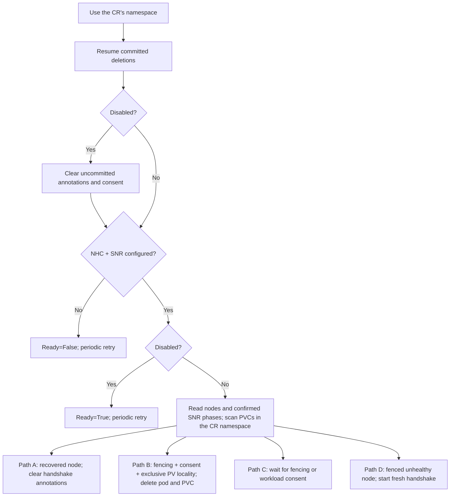

# PodRemediator – Architecture Reference

This document describes the PodRemediator API, controller flow, and workload-independent
behavior. Application-specific recovery policies are outside the controller's scope.

For operator/user documentation see [podremediator_guide.md](podremediator_guide.md).
For integration and test details, see the [Galera notes](podremediator_galera.md),
[RabbitMQ notes](podremediator_rabbitmq.md), and [testing guide](podremediator_testing.md).

<!-- Damien #4104808774: remove the generated-feeling contents summary and state the document's purpose directly. -->

## 1. Design context

### 1.1 Problem

Stateful workloads that use **local persistent storage** face a recurring issue
during node failures: the pod may be rescheduled but the PVC remains bound to the
dead node. Local storage cannot be reattached elsewhere; recovery requires manual
PVC deletion until a dedicated mechanism exists.

### 1.2 Design principles

1. **Workload-owner authorization** — only the operator that owns the workload
   decides whether its recovery policy permits PVC deletion.
2. **Externalized action** — deletion is performed by a separate generic controller;
   application operators stay focused.
3. **Signal-based integration** — PodRemediator publishes a PVC request after SNR
   fencing confirmation; the workload operator grants request-scoped consent.
4. **NHC/SNR coordination** — a NotReady node alone does not authorize a PVC request.

<!-- Damien #4104875625: replace “Agreed” with a descriptive design heading. -->

### 1.3 Workload-specific policy

PodRemediator does not decide whether an application's data is safe to discard.
The workload operator evaluates its own health and recovery policy and is the
only participant that grants or withholds consent. A PVC request is a signal to
evaluate, not an instruction to approve deletion.

### 1.4 Workload integrations

Integration details can change independently of the generic controller. The
[Galera notes](podremediator_galera.md) describe the current Galera adapter; the
[RabbitMQ notes](podremediator_rabbitmq.md) describe the RabbitMQ integration
contract. Neither application's safety checks are requirements imposed on other
workload operators.

<!-- Damien #4104877769, #4104881379, #4104889665: remove the unclear BGP reference and keep Galera implementation details separate from this generic architecture. -->
<!-- Damien #4105140424, #4105153082, #4105170063: keep RabbitMQ-specific behavior, mapping details, and workload comparisons in the integration documentation. -->

## 2. API and Custom Resource

**API group**: `remediation.openstack.org/v1beta1`
**Kind**: `PodRemediator` (Namespaced)

**Source files**:
- `apis/remediation/v1beta1/podremediator_types.go`
- `apis/remediation/v1beta1/annotations.go`
- `config/crd/bases/remediation.openstack.org_podremediators.yaml` (`make manifests`)

### 2.1 Spec

| Field | Type | Default | Description |
|-------|------|---------|-------------|
| `disabled` | `bool` | `false` | Stop annotation and deletion; clear pending consent. |
| `consentPollInterval` | `*metav1.Duration` | `"2m"` | Fallback requeue interval while waiting for fencing or consent. Overrides `PODREMEDIATOR_CONSENT_POLL_INTERVAL`. |
| `periodicPollInterval` | `*metav1.Duration` | `"5m"` | Safety-net requeue for idle states (catches restart-recovery case). Overrides `PODREMEDIATOR_PERIODIC_POLL_INTERVAL`. |

### 2.2 Status Conditions

| Condition | Meaning |
|-----------|---------|
| `Ready=False` / `NHC/SNRNotFound` | NHC or SNR CRs not installed |
| `Ready=False` / `Error` | Scan error; will retry |
| `Ready=True` | Monitoring or active remediation |
| `InputReady=False` | NHC/SNR dependency not satisfied |

### 2.3 PVC Annotations (shared contract)

Defined in `apis/remediation/v1beta1/annotations.go`. Application operators must
use these exact strings (import the package or copy with a cross-reference comment).

| Annotation | Set by | Value | Meaning |
|-----------|--------|-------|---------|
| `remediation.openstack.org/pvc-stuck-on-node` | PodRemediator | node name | Requests workload-operator evaluation; is not consent |
| `remediation.openstack.org/request-id` | PodRemediator | Non-empty opaque ID | Identifies the current fault-scoped request |
| `remediation.openstack.org/remediator-uid` | PodRemediator | PodRemediator UID | Binds the handshake to its owning CR |
| `remediation.openstack.org/fencing-node-uid` | PodRemediator | Node UID | Binds the handshake to the node incarnation |
| `remediation.openstack.org/safe-to-delete` | Application operator | `"true"` | Grants deletion consent |
| `remediation.openstack.org/consent-id` | Application operator | Exact `request-id` | Binds consent to the current request |

The application operator must apply its own safety policy, then patch
`safe-to-delete=true` and `consent-id` equal to the current `request-id` in one
optimistic-locking update. The IDs bind consent to the request being evaluated;
they do not prove that deletion is safe or identify who wrote the annotations.
Without the match, stale consent could authorize a later fault or race with a
changed request.

Consent may be withdrawn before the deletion commit. After the commit, cleanup
continues even if the consent annotations are removed. A newly observed,
unselected Pod can still abort cleanup before the PVC deletion request; after
Kubernetes accepts that request, it cannot be cancelled.

<!-- Damien #4104934389: explain why request-id/consent-id form a request-scoped transaction and what the application operator must write. -->

---

## 3. Controller Internals

**Location**: `internal/controller/remediation/podremediator_controller.go`

### 3.1 Reconcile Entry

1. Fetch the `PodRemediator` instance; return if not found.
2. Initialise status conditions; defer: restore timestamps, mirror Ready, patch status.
3. Add finalizer on first creation; requeue.
4. If `DeletionTimestamp` is set → `reconcileDelete`.
5. Otherwise → `reconcileNormal`.

### 3.2 reconcileDelete

Resumes any previously committed PVC deletion, then clears uncommitted handshake
annotations from PVCs in the PodRemediator's namespace. The finalizer remains
until committed cleanup completes and annotation cleanup succeeds.

### 3.3 reconcileNormal — Paths A/B/C/D


```mermaid
flowchart TD
    V["Use the CR's namespace"] --> R["Resume committed deletions"]
    R --> D{"Disabled?"}
    D -->|Yes| C["Clear uncommitted annotations and consent"]
    C --> N{"NHC + SNR configured?"}
    D -->|No| N
    N -->|No| E["Ready=False; periodic retry"]
    N -->|Yes| M{"Disabled?"}
    M -->|Yes| I["Ready=True; periodic retry"]
    M -->|No| S["Read nodes and confirmed SNR phases; scan PVCs in the CR namespace"]
    S --> A["Path A: recovered node; clear handshake annotations"]
    S --> B["Path B: fencing + consent + exclusive PV locality; delete pod and PVC"]
    S --> W["Path C: wait for fencing or workload consent"]
    S --> P["Path D: fenced unhealthy node; start fresh handshake"]
```

Each PodRemediator watches local PVCs only in its own namespace. Create one
PodRemediator per workload namespace; the controller never lists or cleans PVCs
from another namespace.

When `disabled: true`, the controller still reconciles for two bounded purposes:
it resumes deletion commits that already exist and clears uncommitted annotations
and consent in the CR namespace. This also cancels pending handshakes if NHC/SNR
become unavailable. Cleanup failures are retried. Re-enabling starts fresh
handshakes and requires new workload consent.

<!-- Damien #4104949707: explain that disablement only clears pending handshakes and resumes already committed cleanup. -->

The controller lists Nodes and active (non-deleting) `SelfNodeRemediation`
objects. Only `status.phase: Reboot-Completed` or `Fencing-Completed` passes the
fencing gate. SNR performs the node-remediation action configured by the cluster;
PodRemediator does not issue a power-off or reboot request itself. It publishes
the PVC request annotation only after seeing one of those accepted phases. In the SNR
lifecycle, `Reboot-Completed` follows its safe reboot deadline and precedes
workload removal; `Fencing-Completed` follows that removal. These phases let
PodRemediator wait for SNR's declared safety barrier before publishing the PVC
request or deleting it. They do not move the local PV: its affinity can remain
pinned to the original node after a reboot, so workload recovery may still
require PVC cleanup. A missing phase, unknown phase, deleting SNR, or missing SNR
does not authorize deletion. Merely observing an elapsed `timeAssumedRebooted`
is insufficient. See the
[SNR controller](https://github.com/medik8s/self-node-remediation/blob/main/internal/controller/selfnoderemediation_controller.go).

Every reconcile scans existing handshakes, including when all remaining Nodes are
healthy. A missing Node does not imply recovery: a Node object can disappear
before its PVC has been cleaned up. The controller retains the request and
proceeds only when the current SNR evidence and the PV's pinning to the affected
node can still be established.

<!-- Damien #4104998796, #4105011695: explain what annotation means, when it is written relative to SNR fencing, and why a missing Node does not mean recovery. -->

- **Path A — node recovered:** when the annotated node exists and is healthy,
  remove the handshake annotations so the next fault requires fresh consent.
- **Path B — consent granted:** require confirmed fencing, a non-empty current
  `request-id`, `safe-to-delete=true`, matching `consent-id`, and a bound local
  PV pinned to the annotated node. The controller records the consent before
  cleaning up the selected Pod UIDs and requesting PVC deletion. Existing
  handshakes can complete after the Node object disappears only while current
  SNR evidence and PV locality can still be established.
- **Path C — waiting:** retain the handshake while fencing or consent is missing.
  If an SNR expires or is removed while its node is still unhealthy, deletion
  pauses until fencing can be confirmed again. PVC annotation events trigger
  reconciliation, as do SNR phase changes.
- **Path D — new fault:** only annotate a local PVC after fencing is confirmed for
  its unhealthy node. Strip pre-existing consent in the same patch.

Annotation patches use optimistic concurrency so a concurrent consent change
cannot be silently overwritten. Scan or cleanup failures return an error;
otherwise PVCs waiting for fencing (including those not yet annotated) or consent
use `consentPollInterval`; idle scans use `periodicPollInterval`. Polling remains
a fallback if an SNR or PVC event is missed.

### 3.4 Poll Interval Resolution

```
effectiveInterval(spec.X, r.X, DefaultX):
  spec.X != nil  → use spec.X   (CR, per-instance, hot-reloadable)
  r.X > 0        → use r.X      (env var via main.go, operator-wide)
  otherwise      → use DefaultX (hardcoded: consent=2m, periodic=5m)
```

### 3.5 Local PV Detection

**`isLocalPV(pv)`** accepts local, CSI, and HostPath volumes only when their
required node affinity exclusively identifies one node. Every OR selector term
must pin the same node using a known topology key with `operator: In` and exactly
one non-empty value. `NotIn`, multiple values, conflicting keys, and unpinned or
other-node alternatives are rejected. Additional AND constraints may narrow the
selection but cannot broaden it.

**`getLocalPVNodeName(pv)`** applies those checks using these known keys:

| Key | Driver |
|-----|--------|
| `kubernetes.io/hostname` | hostPath, local, many CSI |
| `topology.topolvm.io/node` | TopoLVM / Red Hat LVMS |
| `topology.lvms.io/node` | LVMS variant |

Zone-affinity volumes (Cinder: `topology.cinder.csi.openstack.org/zone`) are excluded.

Zone affinity identifies an availability zone, not one failed node. Such a PV
may be attachable on another node; deleting its PVC is therefore not the generic
recovery mechanism. CSI volumes are treated as local only when their affinity
proves an exclusive node pin.

<!-- Damien #4105028000: explain why zone-affinity volumes are excluded. -->

If exclusive node pinning cannot be established, `getLocalPVNodeName` returns `""`
and remediation is skipped. Add supported keys to `localPVNodeTopologyKeys` when
integrating another local CSI driver.

### 3.6 Watches

The controller reconciles from PodRemediator, Node, PVC, and SNR changes. Node
and SNR events enqueue the relevant PodRemediator resources; PVC events enqueue
only the CR in that PVC's namespace. SNR events and periodic polling provide
liveness when a watch event is missed. These triggers do not authorize cleanup:
the controller rechecks current fencing evidence and workload consent on every
reconcile.

<!-- Damien #4105038753: remove the low-value watch mapping table and summarize the behavior. -->

---

<!-- Damien #4105049072: remove the standalone RBAC walkthrough from this architecture reference. -->
<!-- Damien #4105064335: remove the implementation/revision log and issue-tracking history from the user-facing architecture. -->

## 4. Current limitations

- PodRemediator authorizes PVC cleanup; it does not guarantee application
  recovery. Workload-specific rejoin, bootstrap, and data-recovery procedures
  remain the responsibility of the application operator.
- A new Pod that uses a PVC after deletion has been requested can keep that PVC
  in `Terminating`. PodRemediator waits and retains its finalizer; the workload
  operator must release the Pod safely. PodRemediator does not change workload
  replica counts or delete replacement Pods.
- The controller accepts only the documented SNR phases as its fencing gate.
  Missing, deleting, or unknown-phase SNR resources block new requests or pause
  cleanup that has not yet been committed.
- Local PV detection uses an explicit set of node-topology keys. A local storage
  driver with an unrecognized key is skipped until that key is supported.
- Status conditions and controller logs expose progress and errors, but status
  does not provide a structured per-PVC remediation list and the controller does
  not emit Kubernetes Events for each handshake step.

<!-- Damien #4105081117, #4105092847, #4105096901: describe current limitations plainly instead of labeling them design risks or tracking fixes. -->
<!-- Damien #4105111786, #4105115350, #4105120131, #4105133282: state the recovery boundary and remove lab-specific failures, roadmap tracking, and undefined Phase 1 terminology. -->

For test responsibilities and what each test layer validates, see the
[PodRemediator testing guide](podremediator_testing.md).

<!-- Damien #4105180193: keep test-layer coverage in a dedicated testing document. -->
