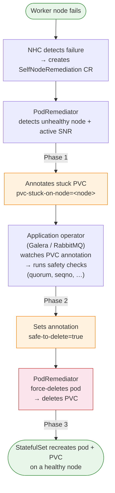
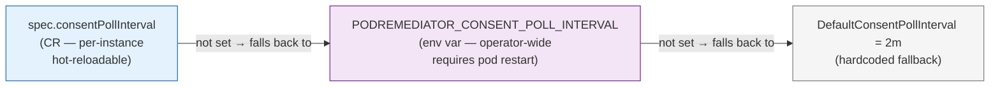

# PodRemediator – Operator Guide

## What is PodRemediator?

PodRemediator is a controller in infra-operator that automates recovery of stateful
workloads using **local persistent storage** (e.g. Galera, RabbitMQ) when a worker
node fails. Local PVCs are node-pinned; they cannot be rescheduled elsewhere until
the volume is deleted and recreated on a healthy node. Without automation this
requires manual intervention that can take tens of minutes.

PodRemediator bridges the gap between the existing OpenShift remediation stack
(NHC + SNR) and the application operators that own the workloads.

---

## How It Works

### Architecture Overview



### The Three-Phase Consent Handshake

PodRemediator never deletes a PVC on its own. Every deletion requires explicit
consent from the application operator:

| Phase | Actor | Action |
|-------|-------|--------|
| 1 | PodRemediator | Annotates stuck PVC: `remediation.openstack.org/pvc-stuck-on-node=<node>` |
| 2 | Application operator | Sets `remediation.openstack.org/safe-to-delete=true` after safety checks |
| 3 | PodRemediator | Force-deletes pod then PVC; StatefulSet reschedules on healthy node |

If the node recovers before the app operator grants consent, PodRemediator removes
both annotations — no deletion occurs. The app operator must re-evaluate on the
next independent fault.

### Dependency on NHC and SNR

PodRemediator **requires** Node Health Check (NHC) and Self Node Remediation (SNR):
- It will not annotate PVCs until NHC has created a `SelfNodeRemediation` CR for
  the unhealthy node. This prevents action during transient NotReady windows (e.g.
  kubelet restart, brief network partition).
- Without NHC/SNR installed the CR stays `Ready=False` with reason `NHC/SNRNotFound`.

### Local PV Detection

PodRemediator only acts on **node-local** PVCs — volumes whose PV is pinned to a
specific node via topology affinity. Supported storage types:

| Storage | Topology key |
|---------|-------------|
| Kubernetes local volumes | `kubernetes.io/hostname` |
| TopoLVM / Red Hat LVMS | `topology.topolvm.io/node`, `topology.lvms.io/node` |
| HostPath CSI | `kubernetes.io/hostname` |

Zone-affinity CSI volumes (e.g. Cinder: `topology.cinder.csi.openstack.org/zone`)
are **excluded** — they can be reattached across nodes and do not need PVC deletion.

### Galera Integration

Galera requires special care: naive PVC deletion can break quorum. The mariadb-operator
`podremediator` branch implements `CheckForStuckPVCRequiringRemediation` with:

1. **Auto-detection** — uses the REST mapper to detect whether PodRemediator CRD is installed.
   If it is not present the function is a silent no-op; no configuration change needed.
2. **k8s quorum gate** — `AvailableReplicas >= floor(Replicas/2)+1` before any consent.
3. **wsrep gate** — queries live `wsrep_cluster_size` via pod exec to verify the actual
   Galera cluster view, not just k8s pod readiness. Fail-open if exec is unavailable.
4. **Seqno-aware ordering** — the pod with the highest seqno (most up-to-date Galera state)
   receives consent last. Among the rest, lowest-ordinal first. One PVC per reconcile.
5. **Status observability** — `Galera.status.pvcRemediation` (map keyed by PVC name) reflects
   the in-flight handshake state (`stuckNode`, `consentGranted`) on every reconcile. The
   field is nil when no PVCs are stuck — no noise in the normal operating state.

---

## Deployment

### Prerequisites

Verify each prerequisite before creating the `PodRemediator` CR.

**1. infra-operator is running**
```bash
oc get deployment -n openstack-operators | grep infra-operator
# Expected: infra-operator-controller-manager   1/1   Running
```

**2. PodRemediator CRD is registered**
```bash
oc get crd podremediators.remediation.openstack.org
# Expected: NAME                                          CREATED AT
#           podremediators.remediation.openstack.org      <timestamp>
```
If missing, apply it:
```bash
oc apply -f config/crd/bases/remediation.openstack.org_podremediators.yaml
```

**3. NHC is installed and has at least one NodeHealthCheck CR**
```bash
oc get nodehealthcheck
# Expected: at least one row. No rows → NHC not configured; PodRemediator will stay Ready=False.
```

**4. SNR is installed and has at least one SelfNodeRemediationTemplate CR**
```bash
oc get selfnoderemediationtemplate -A
# Expected: at least one row. No rows → SNR not configured; PodRemediator will stay Ready=False.
```

**5. Application operator supports the consent handshake** (for Galera)

The mariadb-operator `podremediator` branch auto-detects whether PodRemediator is installed
via the REST mapper — no configuration change needed on the Galera CR. Verify the right image
is running:
```bash
oc get deployment mariadb-operator-controller-manager -n openstack-operators \
  -o jsonpath='{.spec.template.spec.containers[0].image}'
# Should show your podremediator-branch image if using a custom build.
```

---

### Install

**Step 1 — Create the PodRemediator CR**

```yaml
apiVersion: remediation.openstack.org/v1beta1
kind: PodRemediator
metadata:
  name: podremediator
  namespace: openstack-operators
spec:
  namespaces:
    - openstack              # add every namespace where your stateful workloads run
    - openstack-operators    # include operator namespace if needed
```

```bash
oc apply -f the-above.yaml
```

**Step 2 — Verify the CR is Ready**

```bash
oc get podremediator -n openstack-operators
# NAME             READY   MESSAGE
# podremediator    True    No unhealthy nodes; monitoring
```

If `READY=False`:
- Message contains "NHC/SNR" → fix prerequisites 3 and 4 above.
- Message contains "errors" → check infra-operator logs:
  ```bash
  oc logs -n openstack-operators -l app.kubernetes.io/name=infra-operator --tail=50
  ```

**Step 3 — Verify PodRemediator watches the right namespaces**

```bash
oc get podremediator podremediator -n openstack-operators \
  -o jsonpath='{.spec.namespaces}' | tr ',' '\n'
# Should list all namespaces where your workloads run (e.g. openstack, openstack-cell1)
```

If a workload namespace is missing, patch it in:
```bash
oc patch podremediator podremediator -n openstack-operators --type=merge \
  -p '{"spec":{"namespaces":["openstack-operators","openstack"]}}'
```

**Step 4 — Confirm the application operator is ready (Galera)**

```bash
oc get galera -n openstack
# NAME        READY   MESSAGE
# openstack   True    ...
```

For the Galera consent handshake to activate, the mariadb-operator must be running a build
that includes `CheckForStuckPVCRequiringRemediation`. The feature auto-detects PodRemediator
at runtime — no Galera CR change needed.

---

### Quick install health-check

Run this after install to confirm everything is wired up:

```bash
echo "=== infra-operator ===" && \
  oc get deployment mariadb-operator-controller-manager infra-operator-controller-manager \
    -n openstack-operators 2>/dev/null | grep -E "NAME|1/1"

echo "=== PodRemediator CR ===" && \
  oc get podremediator -n openstack-operators

echo "=== NHC ===" && \
  oc get nodehealthcheck 2>/dev/null | head -5

echo "=== SNR template ===" && \
  oc get selfnoderemediationtemplate -A 2>/dev/null | head -5

echo "=== Galera ===" && \
  oc get galera -n openstack 2>/dev/null | head -5
```

All outputs should show healthy / at-least-one-row results before running an E2E test.

### Status messages

| Ready | Message | Meaning |
|-------|---------|---------|
| `False` | "Node Health Check (NHC) and Self Node Remediation (SNR) are required…" | Install/configure NHC and SNR |
| `True` | "No unhealthy nodes; monitoring" | Healthy, nothing to do |
| `True` | "N PVC(s) waiting for app-operator safe-to-delete consent" | PVCs annotated, waiting for app operator |
| `True` | "Monitoring; remediating PVCs on unhealthy nodes as authorized" | Active remediation in progress |
| `False` | "Partial scan: errors listing PVCs or fetching PVs; will retry" | Transient API error; will retry |

---

## Configuration Reference

### PodRemediator CR spec fields

| Field | Type | Default | Description |
|-------|------|---------|-------------|
| `namespaces` | `[]string` | (empty = CR namespace only) | Namespaces to watch for local PVCs. |
| `disabled` | `bool` | `false` | Disables annotation and deletion; controller still monitors. Set to `true` for maintenance windows. |
| `consentPollInterval` | `metav1.Duration` | `"2m"` | How often to retry Path C (annotated PVC waiting for app-operator consent). Lower = faster response, higher = less API load. |
| `periodicPollInterval` | `metav1.Duration` | `"5m"` | Safety-net requeue for all idle states. Ensures the controller catches pre-existing unhealthy nodes after an operator pod restart (when no node-transition event fires). |

### Operator-wide environment variables

Set in the infra-operator Deployment env block. CR spec values take priority.

| Variable | Default | Description |
|----------|---------|-------------|
| `PODREMEDIATOR_CONSENT_POLL_INTERVAL` | `2m` | Operator-wide default for `consentPollInterval`. Go duration string (e.g. `"90s"`). Invalid values are logged and fall back to the hardcoded default. |
| `PODREMEDIATOR_PERIODIC_POLL_INTERVAL` | `5m` | Operator-wide default for `periodicPollInterval`. Go duration string (e.g. `"2m"`). Invalid values are logged and fall back to the hardcoded default. |

**Verifying active configuration:** On startup `main.go` logs the resolved values:
```
INFO  PodRemediator configured  consentPollInterval=2m0s  periodicPollInterval=5m0s
```
Check the infra-operator pod logs to confirm the intended intervals are active.

**Priority chain:**



Same chain applies for `periodicPollInterval` / `PODREMEDIATOR_PERIODIC_POLL_INTERVAL` / `DefaultPeriodicPollInterval = 5m`.

### Tuning guidance

| Scenario | Recommended values |
|----------|--------------------|
| Default production (3-node Galera, standard NHC timing ~5-10 min) | `consentPollInterval: 2m`, `periodicPollInterval: 5m` |
| Lab / fast iteration (frequent operator restarts) | `periodicPollInterval: 1m` |
| Large cluster (>100 PVCs per namespace, reduce API load) | `consentPollInterval: 5m`, `periodicPollInterval: 10m` |
| Aggressive recovery SLO | `consentPollInterval: 30s`, `periodicPollInterval: 2m` |

> **Note:** `periodicPollInterval` only matters for the restart-recovery case. In normal
> operation, node-transition events trigger immediate reconciliation.

---

## Operations

### Disable PVC remediation

```yaml
spec:
  disabled: true
```

Use during maintenance windows. The controller still requires NHC/SNR and reports
`Ready=True` with a disabled message. Re-enable by setting `disabled: false`.

### Watch multiple namespaces

```yaml
spec:
  namespaces:
    - openstack
    - openstack-cell1
    - my-app
```

### What the application operator must do

When PodRemediator annotates a PVC with `pvc-stuck-on-node`, the app operator must:

1. **Detect** the annotation — watch PVCs with `AnnotationChangedPredicate`.
2. **Check safety** — quorum, replication state, seqno (workload-specific).
3. **Grant consent** — set `remediation.openstack.org/safe-to-delete=true`.

PodRemediator then force-deletes the referencing pod and the PVC. If the node
recovers before consent is granted, PodRemediator removes both annotations and no
deletion occurs. Fresh consent is required on each independent fault event.

### Consent annotation strings (shared contract)

These annotation keys are defined in `apis/remediation/v1beta1/annotations.go` in the
infra-operator repository. Application operators should reference that package or copy
the string constants with a cross-reference comment to prevent drift.

| Annotation | Value | Set by |
|-----------|-------|--------|
| `remediation.openstack.org/pvc-stuck-on-node` | Node name | PodRemediator |
| `remediation.openstack.org/safe-to-delete` | `"true"` | Application operator |

---

## E2E Testing

E2E tests live in `pidone/ngtestkit` → `podremediator-tests/`:

| Script flag | Scenario |
|-------------|---------|
| `E2E_GALERA=1` | Single worker down, full three-phase handshake (baseline) |
| `E2E_GALERA_QUORUM=1` | 2 different workers down simultaneously — quorum gate refuses consent |
| `E2E_GALERA_COLOCATED=1` | 2 Galera members on same worker, single virsh destroy |
| `E2E_GALERA_CELL1=1` | Cell1 Galera cluster |
| `E2E_RABBITMQ=1` | RabbitMQ workload |

Run from the repository root:
```bash
E2E_GALERA=1 SYNC=1 ./podremediator-tests/scripts/run-e2e.sh
```

See `podremediator-tests/docs/GALERA_E2E_TEST_SCENARIOS.md` for scenario details.
