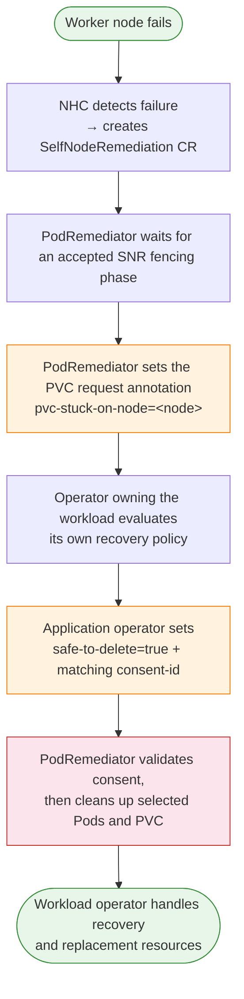
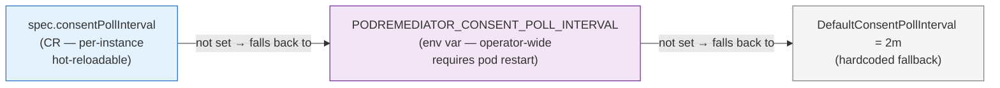

# PodRemediator – Operator Guide

## What is PodRemediator?

PodRemediator is an infra-operator controller configured through namespaced
`PodRemediator` custom resources (CRs). Each CR watches PVCs in its own namespace,
so create one CR in each workload namespace that needs remediation.

When a worker fails, a local PVC may remain bound to that node and prevent the
workload from starting elsewhere. PodRemediator coordinates PVC cleanup after
SNR fencing confirmation and consent from the application operator that owns the
workload. It unblocks recovery work; it does not guarantee that the application
will recover.

<!-- Damien #4103610797, #4103775536, #4103816578: distinguish controller from CR and explain namespace scope early. -->

PodRemediator bridges the gap between the existing OpenShift remediation stack
(NHC + SNR) and the application operators that own the workloads.

---

## How It Works

### Architecture Overview


```mermaid
flowchart TD
    A([Worker node fails]) --> B

    B["NHC detects failure\n→ creates SelfNodeRemediation CR"]
    B --> C

    C["PodRemediator waits for an accepted SNR fencing phase"]
    C --> D

    D["PodRemediator sets the PVC request annotation\npvc-stuck-on-node=&lt;node&gt;"]
    D --> E

    E["Operator owning the workload evaluates\nits own recovery policy"]
    E --> F

    F["Application operator sets\nsafe-to-delete=true + matching consent-id"]
    F --> G

    G["PodRemediator validates consent,\nthen cleans up selected Pods and PVC"]
    G --> H

    H([Workload operator handles recovery\nand replacement resources])

    style A fill:#e8f5e9,stroke:#388e3c
    style H fill:#e8f5e9,stroke:#388e3c
    style D fill:#fff3e0,stroke:#f57c00
    style F fill:#fff3e0,stroke:#f57c00
    style G fill:#fce4ec,stroke:#c62828
```

### Consent handshake

<!-- Damien #4093532485, #4093540086, #4093550661, #4093556723, #4093560665, #4093685462: clarify the request/consent actors, keep safety policy workload-specific, and include both consent annotations. -->

PodRemediator never deletes a PVC on its own. Every deletion requires explicit
consent from the application operator:

| Step | Actor | Action |
|-------|-------|--------|
| 1 | PodRemediator | After SNR fencing confirmation, sets `pvc-stuck-on-node` and a fresh `request-id`, clearing stale consent. |
| 2 | Operator owning the workload | Applies its own safety policy, then sets `safe-to-delete=true` and `consent-id` equal to the current `request-id` in one update. |
| 3 | PodRemediator | Revalidates fencing, PVC locality, and current consent before cleaning up selected Pods and requesting PVC deletion. |

Until SNR reports an accepted fencing phase, PodRemediator does not publish a
PVC request. The application operator is not notified through PVC annotations
during that wait; the PodRemediator status reports PVCs waiting for fencing.

If the node recovers before the app operator grants consent, PodRemediator removes
the pending handshake annotations — no deletion occurs. Consent can also be
withdrawn before PodRemediator commits the deletion. Once committed, cleanup
continues and cannot be cancelled by removing the annotations.

### Dependency on NHC and SNR

PodRemediator **requires** Node Health Check (NHC) and Self Node Remediation (SNR):
- A non-deleting `SelfNodeRemediation` CR must report phase `Reboot-Completed`
  or `Fencing-Completed` before PodRemediator publishes a PVC request or deletes
  a PVC. SNR performs the configured node-remediation action; PodRemediator uses
  its reported phase as the safety gate and does not trigger a reboot or fencing
  action itself.
- An SNR object without an accepted phase, a deleting SNR, or an unknown phase
  does not authorize cleanup, even when the workload operator has consented.
- If the failed Node object disappears, existing handshakes can still complete
  with confirmed fencing and consent. If the SNR disappears first, they wait.
- Without NHC/SNR installed the CR stays `Ready=False` with reason `NHC/SNRNotFound`.

### Local PV Detection

PodRemediator only acts on **node-local** PVCs — volumes whose PV is pinned to a
specific node via topology affinity. Every affinity alternative must select the
same node with a singleton `In` expression on a supported key. Ambiguous or
multi-node affinity is skipped. Supported storage types:

| Storage | Topology key |
|---------|-------------|
| Kubernetes local volumes | `kubernetes.io/hostname` |
| TopoLVM / Red Hat LVMS | `topology.topolvm.io/node`, `topology.lvms.io/node` |
| HostPath CSI | `kubernetes.io/hostname` |

Zone-affinity CSI volumes (e.g. Cinder: `topology.cinder.csi.openstack.org/zone`)
are **excluded** because a zone does not identify one failed node. Such volumes
can be attached on another node and do not need this node-local PVC deletion flow.

<!-- Damien #4104998796 and #4105028000: clarify SNR's role and why zone-locality does not qualify as node-local storage. -->

### Workload-specific integration

PodRemediator does not implement Galera or RabbitMQ safety policy. Each workload
operator decides whether its own recovery policy permits deletion. See the
[Galera integration notes](podremediator_galera.md); RabbitMQ-specific behavior
belongs with its workload operator.

<!-- Damien #4103760894: keep Galera implementation details out of the generic workflow. -->

---

## Deployment

### Prerequisites

Verify each prerequisite before creating the `PodRemediator` CR.

**1. infra-operator is running**
```bash
oc get deployment -n openstack-operators | grep infra-operator
# Expected: infra-operator-controller-manager   1/1   Running
```

**2. PodRemediator CRD is registered**
```bash
oc get crd podremediators.remediation.openstack.org
# Expected: NAME                                          CREATED AT
#           podremediators.remediation.openstack.org      <timestamp>
```
If missing, apply it:
```bash
oc apply -f config/crd/bases/remediation.openstack.org_podremediators.yaml
```

**3. NHC is installed and has at least one NodeHealthCheck CR**
```bash
oc get nodehealthcheck
# Expected: at least one row. No rows → NHC not configured; PodRemediator will stay Ready=False.
```

**4. SNR is installed and has at least one SelfNodeRemediationTemplate CR**
```bash
oc get selfnoderemediationtemplate -A
# Expected: at least one row. No rows → SNR not configured; PodRemediator will stay Ready=False.
```

**5. The workload operator implements the consent contract**

The operator that owns the workload must watch for PodRemediator's PVC request
and write both consent annotations described below. A `safe-to-delete` annotation
alone is not accepted.

<!-- Damien #4103768390, #4103781194: remove the branch/image check and temporary Galera implementation instructions. -->

---

### Install

**Step 1 — Create the PodRemediator CR**

```yaml
apiVersion: remediation.openstack.org/v1beta1
kind: PodRemediator
metadata:
  name: podremediator
  namespace: openstack
spec:
  # PVC remediation is enabled when the CR is applied.
```

```bash
oc apply -f the-above.yaml
```

**Step 2 — Verify the CR is Ready**

```bash
oc get podremediator -n openstack
```

If `READY` is false, inspect the condition reason and message with
`oc describe podremediator -n openstack`. For dependency or reconciliation
errors, check infra-operator logs:
  ```bash
  oc logs -n openstack-operators -l app.kubernetes.io/name=infra-operator --tail=50
  ```

**Step 3 — Scope**

PodRemediator watches local PVCs only in its own namespace. Create a separate
PodRemediator in each workload namespace that needs remediation.

**Step 4 — Confirm the workload operator is ready**

Check the application custom resource and operator status using that workload's
operating procedure. PodRemediator cannot determine whether the application is
healthy or recoverable.

---

### Quick install health-check

Run this after install to check that the operator, CR, and NHC/SNR prerequisites
are present:

```bash
echo "=== infra-operator ===" && \
  oc get deployment infra-operator-controller-manager \
    -n openstack-operators 2>/dev/null | grep -E "NAME|1/1"

echo "=== PodRemediator CR ===" && \
  oc get podremediator -n openstack

echo "=== NHC ===" && \
  oc get nodehealthcheck 2>/dev/null | head -5

echo "=== SNR template ===" && \
  oc get selfnoderemediationtemplate -A 2>/dev/null | head -5

```

Confirm the deployment is available, the CR is Ready, and NHC/SNR prerequisites
exist. This check does not run or validate a real node-failure scenario.

<!-- Damien #4103788239: retain this as a prerequisite smoke check, but remove the unexplained E2E reference. -->

### Troubleshooting

Use `oc describe podremediator` to inspect the current conditions and their
reason and message. The message text can change between releases.

- If the Ready condition reason is `NHC/SNRNotFound`, install and configure NHC
  and SNR.
- If the status reports PVCs waiting for fencing, check that a non-deleting SNR
  for the affected node has reached an accepted phase. No PVC request is
  published before then.
- If a PVC has a current request but no consent, ask the workload operator to
  evaluate its recovery policy and write the matching consent annotations.
- For reconciliation errors, inspect the infra-operator logs:
  ```bash
  oc logs -n openstack-operators -l app.kubernetes.io/name=infra-operator --tail=50
  ```
- If the Ready condition reason is `ReplacementPodBlocksPVCDeletion`, a
  replacement Pod is using a PVC whose deletion has already been requested.
  The workload operator must release that Pod safely; do not remove finalizers
  to bypass the wait.

<!-- Damien #4103802020: replace the copied Ready-message table with cause-based troubleshooting. -->

---

## Configuration Reference

### PodRemediator CR spec fields

| Field | Type | Default | Description |
|-------|------|---------|-------------|
| `disabled` | `bool` | `false` | Stops new requests and clears pending consent. Cleanup that has already been committed continues. Set to `true` for maintenance windows. |
| `consentPollInterval` | `metav1.Duration` | `"2m"` | Fallback retry interval for PVCs waiting for fencing or app-operator consent. Lower = faster response, higher = less API load. |
| `periodicPollInterval` | `metav1.Duration` | `"5m"` | Safety-net requeue for all idle states. Ensures the controller catches pre-existing unhealthy nodes after an operator pod restart (when no node-transition event fires). |

SNR phase changes trigger reconciliation without waiting for a poll. The SNR
watch is optional and reconnects if its CRD is installed after operator startup.
Polling remains a fallback during watch interruptions.

### Operator-wide environment variables

Set in the infra-operator Deployment env block. CR spec values take priority.

| Variable | Default | Description |
|----------|---------|-------------|
| `PODREMEDIATOR_CONSENT_POLL_INTERVAL` | `2m` | Operator-wide default for `consentPollInterval`. Go duration string (e.g. `"90s"`). Invalid values are logged and fall back to the hardcoded default. |
| `PODREMEDIATOR_PERIODIC_POLL_INTERVAL` | `5m` | Operator-wide default for `periodicPollInterval`. Go duration string (e.g. `"2m"`). Invalid values are logged and fall back to the hardcoded default. |

**Verifying active configuration:** On startup `main.go` logs the resolved values:
```
INFO  PodRemediator configured  consentPollInterval=2m0s  periodicPollInterval=5m0s
```
Check the infra-operator pod logs to confirm the intended intervals are active.

**Priority chain:**


```mermaid
flowchart LR
    A["spec.consentPollInterval\n(CR — per-instance\nhot-reloadable)"]
    B["PODREMEDIATOR_CONSENT_POLL_INTERVAL\n(env var — operator-wide\nrequires pod restart)"]
    C["DefaultConsentPollInterval = 2m\n(hardcoded fallback)"]

    A -->|"not set → falls back to"| B
    B -->|"not set → falls back to"| C

    style A fill:#e3f2fd,stroke:#1565c0
    style B fill:#f3e5f5,stroke:#6a1b9a
    style C fill:#f5f5f5,stroke:#757575
```

Same chain applies for `periodicPollInterval` / `PODREMEDIATOR_PERIODIC_POLL_INTERVAL` / `DefaultPeriodicPollInterval = 5m`.

### Tuning guidance

| Scenario | Recommended values |
|----------|--------------------|
| General starting point | `consentPollInterval: 2m`, `periodicPollInterval: 5m` |
| Faster retry after missed events | Reduce `periodicPollInterval`; this increases API activity. |
| Lower API activity in large namespaces | Increase the intervals; this may delay fallback retries. |
| Workload-specific recovery target | Tune the intervals with the workload operator and cluster's NHC/SNR timing. |

> **Note:** `periodicPollInterval` only matters for the restart-recovery case. In normal
> operation, node-transition events trigger immediate reconciliation.

---

## Operations

### Disable PVC remediation

```yaml
spec:
  disabled: true
```

Use during maintenance windows. Disabling clears uncommitted request and consent
annotations in the CR's namespace, even when NHC/SNR are unavailable. Cleanup
that crossed the deletion commit boundary continues and is retried if necessary.
Re-enable by setting `disabled: false`; cancelled requests need fresh consent.

### Watch a workload namespace

PodRemediator is namespace-scoped: each CR watches and cleans PVCs only in its
own namespace. Create one CR in each workload namespace that needs remediation;
one CR cannot watch PVCs in multiple namespaces.

### What the application operator must do

The operator that owns the PVC evaluates its workload-specific recovery policy.
When deletion is safe, it writes `safe-to-delete=true` and the current
`request-id` as `consent-id` in the same optimistic-locking update. See the
[consent contract](podremediator_architecture.md#23-pvc-annotations-shared-contract)
for the complete request and commit behavior.

<!-- Damien #4104689872: keep the detailed contract in the architecture reference; retain only the operator action here. -->

### Consent annotation strings (shared contract)

These annotation keys are defined in `apis/remediation/v1beta1/annotations.go` in the
infra-operator repository. Application operators should reference that package or copy
the string constants with a cross-reference comment to prevent drift.

| Annotation | Value | Set by |
|-----------|-------|--------|
| `remediation.openstack.org/pvc-stuck-on-node` | Node name | PodRemediator |
| `remediation.openstack.org/request-id` | Non-empty ID for the current request | PodRemediator |
| `remediation.openstack.org/remediator-uid` | PodRemediator UID | PodRemediator |
| `remediation.openstack.org/fencing-node-uid` | Node UID | PodRemediator |
| `remediation.openstack.org/safe-to-delete` | `"true"` | Application operator |
| `remediation.openstack.org/consent-id` | Exact `request-id` | Application operator |

`consent-id` must equal the current `request-id`; consent with a missing or stale
request ID is ignored. PodRemediator clears the full handshake when the node
recovers or the CR is deleted.

---

## Testing

The test guide describes the in-repository unit, functional, and KUTTL tests,
and the separate requirements for real-cluster validation:
[PodRemediator testing](podremediator_testing.md).

<!-- Damien #4104796972: move lab test instructions out of the operator guide and document the environment in the dedicated test guide. -->
