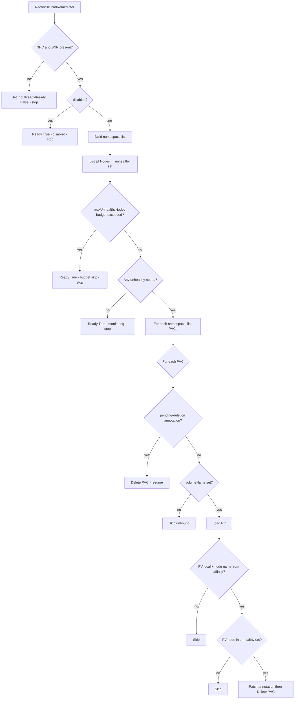

# PodRemediator operator – behavior (implementation detail)

This document describes **only** the **PodRemediator** controller and CR: what it does, how it decides, and **implications for workloads**. It does **not** cover lab playbooks, E2E harnesses, or deployment POC steps.

**Customer‑oriented guide** (problem statement, prerequisites, configuration checklist, FAQ): see [`PODREMEDIATOR_CUSTOMER_GUIDE.md`](PODREMEDIATOR_CUSTOMER_GUIDE.md).

**Source of truth in code:** `apis/remediation/v1beta1/podremediator_types.go`, `internal/controller/remediation/podremediator_controller.go`.

---

## 1. Role in the cluster

**PodRemediator** is a **remediation.openstack.org** controller that reacts when **worker nodes become unhealthy** (from Kubernetes’ point of view: `NodeReady != True`). If **medik8s** remediation primitives are present (**NodeHealthCheck**, **SelfNodeRemediationTemplate**), **`spec.disabled`** is **false** (default — remediation **enabled** when you apply the CR), and a **disruption budget** (`maxUnhealthyNodes`) is not blocking, it **deletes selected PersistentVolumeClaims** so that **StatefulSets and other controllers** can recreate volumes and pods on healthy nodes.

It does **not** replace NHC/SNR: it **assumes** the cluster will remediate or isolate the bad node via those mechanisms. It focuses on **freeing node‑pinned storage** (local / topology‑bound PVs) that would otherwise keep a pod stuck on a dead or cordoned node.

---

## 2. Custom resource: `PodRemediator`

### `spec.namespaces`

- List of namespaces where the controller **lists PVCs** during reconcile.
- If **empty**, the controller uses **only the namespace of the PodRemediator CR** itself.
- To remediate PVCs in the OpenStack workload namespace (e.g. `openstack`), that namespace **must** appear here (or the CR must live in that namespace with an empty list).

### `spec.disabled`

- Default **false**: applying the CR expects PVC remediation to be **enabled** once NHC/SNR are present.
- Set **`disabled: true`** to opt out (monitoring only; same spirit as Instance HA **DISABLED** in config).

### `spec.maxUnhealthyNodes`

- **Optional non-negative integer** — a cluster-wide **disruption budget** on unhealthy **nodes** for PVC remediation (related in spirit to **PodDisruptionBudget**, but keyed on NotReady node count).
- **0** (omitted) means **no limit** — same behavior as before this field existed.
- When set to a **positive** value **N**, the controller **does not delete any PVC** (and does not process pending-deletion resumes in that reconcile) while the count of **NotReady** nodes is **strictly greater than N**.
- Rationale: for a **3-replica** Galera StatefulSet, operators often set **`N: 1`** so automated volume stripping does not run during **multi-node** incidents—only single-worker failures trigger remediation—similar in intent to **Instance HA `THRESHOLD`** limiting actions during mass failure.
- When the threshold blocks remediation, **`Ready`** is **True** with a message like `PVC remediation skipped: X unhealthy nodes exceed maxUnhealthyNodes (N)`.

---

## 3. Hard prerequisites (controller gates)

Before any PVC logic runs, the controller checks the **cluster** (via dynamic client) for:

| Resource | API group | Purpose |
|----------|-----------|---------|
| At least one **NodeHealthCheck** | `remediation.medik8s.io/v1alpha1` | NHC installed |
| At least one **SelfNodeRemediationTemplate** | `self-node-remediation.medik8s.io/v1alpha1` | SNR installed |

If **either** list is empty or CRDs are missing (`NoMatch` / `NotFound` treated as absent):

- **`InputReady`** = **False**, reason `NHC/SNRNotFound`, message explains NHC+SNR are required.
- **`Ready`** = **False** for the same reason.
- **No PVC is examined or deleted.**

If the dynamic **list** fails for another reason, conditions go to **Error** and reconcile returns the error.

---

## 4. What triggers a reconcile

Registered watches (`SetupWithManager`):

| Object | Predicate (if any) | Effect |
|--------|----------------------|--------|
| **PodRemediator** | (primary `For`) | Any change to the CR. |
| **Pod** | `GenerationChangedPredicate` | Reconcile for **every** `PodRemediator` in the **same namespace** as the pod when pod generation changes. |
| **PersistentVolumeClaim** | `GenerationChangedPredicate` | Same: enqueue **all** `PodRemediator` resources in that PVC’s namespace. |
| **Node** | none | Enqueue **all** `PodRemediator` in the cluster (namespace filter omitted in list). |

**Implication:** reconcile frequency scales with pod/PVC churn in watched namespaces; the work inside reconcile is bounded by listing nodes + PVCs in configured namespaces.

---

## 5. Reconcile flow (normal operation)

### 5.1 Unhealthy node definition

A node is **unhealthy** if, among `status.conditions`, **`NodeReady`** exists and **`status != True`**.  
If there is no `NodeReady` condition, the node is **not** treated as unhealthy by this function.

**Implication:** any `NotReady`, `Unknown`, or missing Ready condition causes the node to be in the **unhealthy** set. This is a **simplified** signal; it does **not** parse NHC’s per‑node remediation state directly in this code path.

### 5.2 PVC selection (per PVC, in each watched namespace)

1. **Resume path:** If `pvc.metadata.annotations["remediation.openstack.org/podremediator-pending-deletion"]` is **non‑empty**, the value is treated as the **node name** that was unhealthy when the intent was recorded. The controller **deletes the PVC** immediately (idempotent if already gone). This covers **controller restart** after annotate but before delete.

2. Otherwise, if **`pvc.spec.volumeName` is empty** → **skip** (unbound / Pending PVC). Log: “Skipping PVC (unbound)”.

3. Load **`PersistentVolume`** by `pvc.spec.volumeName`. If missing → skip.

4. **`isLocalPV(pv)`** must be **true**:
   - `spec.local` set, **or**
   - `spec.csi` set **and** `spec.nodeAffinity.required` has at least one `nodeSelectorTerm`, **or**
   - `spec.hostPath` set **and** same node affinity requirement.

   Otherwise → **skip** (“PV not local”).

5. **`getLocalPVNodeName(pv)`** must return a **non‑empty** node name, derived from **`spec.nodeAffinity.required.nodeSelectorTerms`**:
   - Preferred keys: `kubernetes.io/hostname`, `topology.topolvm.io/node`, `topology.lvms.io/node`.
   - Fallback for CSI: single term, single value, key contains `hostname` or `node`.

   If empty → **skip** (“hostname not found”).

6. If that node name is **not** in the **unhealthy** map → **skip** (“node not unhealthy”).

7. **Else:** patch the PVC with annotation **`remediation.openstack.org/podremediator-pending-deletion`** = node name, then **`Delete`** the PVC.

### 5.3 Status when work finishes

- If there were **no** unhealthy nodes: **Ready=True**, message like “No unhealthy nodes; monitoring”.
- After processing PVCs (including none to delete): **Ready=True**, message like “Monitoring; remediated PVCs on unhealthy nodes if any”.

---

## 6. Annotation: `remediation.openstack.org/podremediator-pending-deletion`

- **Value:** node name that was unhealthy when remediation was decided.
- **Purpose:** persist **intent to delete** across controller restarts (comment in code references the same pattern as Instance HA for resumable state).
- **Behavior on next reconcile:** if the annotation is still set, the controller attempts **delete** again without re‑evaluating node health for that path (so a stuck annotation could be dangerous—operational hygiene matters).

---

## 7. Implications for pods and workloads

### Direct effects

- The controller **does not delete Pods** in the reconcile path shown (RBAC may still allow `pods/delete` for other reasons; the core remediation action here is **PVC delete**).
- **Deleting a PVC** causes Kubernetes to remove the claim; for a **StatefulSet** with `volumeClaimTemplates`, the controller typically **recreates** a PVC with the same name and provisions a **new** PV, allowing a pod to schedule on a node where storage can attach.

### Who is affected

- **Only PVCs** in **`spec.namespaces`** (or CR namespace if empty) that are **Bound**, backed by a **local‑like** PV with **node affinity**, and whose **affinity node** is currently **unhealthy** (or PVC already annotated for resume).
- Workloads using **network / shared** storage without that node topology pattern are **not** selected by `isLocalPV` / `getLocalPVNodeName` as implemented.

### Risks / operational notes

- **Data loss:** deleting a PVC is **destructive** for the data on that volume unless replicated elsewhere. This is intentional for “stuck on dead node” recovery with local disks.
- **False positives:** if `NodeReady` flaps or misreports, PVCs tied to that node could be deleted while the node is still partially usable—depends on cluster and NHC/SNR behavior outside this controller.
- **Scope:** forgetting to add a workload namespace to **`spec.namespaces`** means **no remediation** there even if nodes are unhealthy.

---

## 8. Finalizers and deletion of the `PodRemediator` CR

- On create, the generic **helper** finalizer is added; on **`PodRemediator` delete**, `reconcileRemove` clears it. There is **no** per‑PVC cleanup in delete beyond stopping reconciliation for that CR instance.

---

## 9. Summary table

| Topic | Behavior |
|--------|-----------|
| **Without NHC/SNR** | Ready=False; no PVC changes. |
| **`disabled: true`** | Ready=True (disabled); no PVC deletes. |
| **`maxUnhealthyNodes` budget blocks** | Ready=True (skipped); no PVC deletes that reconcile. |
| **No unhealthy nodes** | Ready=True; monitoring only. |
| **Unbound PVC** | Skipped. |
| **Non‑local PV** | Skipped. |
| **Local PV, healthy node** | Skipped. |
| **Local PV, unhealthy node** | Annotate + delete PVC. |
| **Pods** | Not deleted by this reconcile; indirect effect via PVC loss and higher‑level controllers. |

---

*For end‑to‑end validation procedures (Ansible, virsh, RabbitMQ preflight), see [`PODREMEDIATOR_POC_RUNBOOK.md`](./PODREMEDIATOR_POC_RUNBOOK.md) and [`STATEFUL_PVC_REMEDIATION_TEST_PLAN.md`](./STATEFUL_PVC_REMEDIATION_TEST_PLAN.md)—they are intentionally out of scope for this file.*
